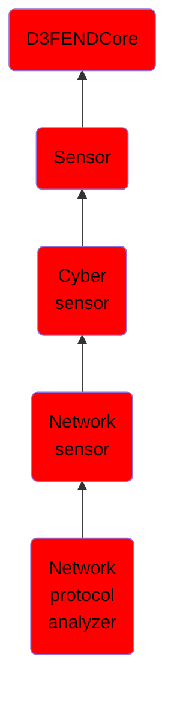

# Network protocol analyzer

## Overview

### Definition
Monitors and parses network protocols to extract values from various network protocol layers.

### Examples
Not defined.

### Aliases
Not defined.

### URI
http://d3fend.mitre.org/ontologies/d3fend.owl#NetworkProtocolAnalyzer

### Subclass Of

- [D3FENDCore](/docs/ontology/reference/model/D3FENDCore/D3FENDCore.md)
- [Sensor](/docs/ontology/reference/model/D3FENDCore/Sensor/Sensor.md)
- [Cyber sensor](/docs/ontology/reference/model/D3FENDCore/Sensor/Cyber%20sensor/Cyber%20sensor.md)
- [Network sensor](/docs/ontology/reference/model/D3FENDCore/Sensor/Cyber%20sensor/Network%20sensor/Network%20sensor.md)
- [Network protocol analyzer](/docs/ontology/reference/model/D3FENDCore/Sensor/Cyber%20sensor/Network%20sensor/Network%20protocol%20analyzer/Network%20protocol%20analyzer.md)

### Ontology Reference
- [d3fend](http://d3fend.mitre.org/ontologies/d3fend.owl#)

## Properties
