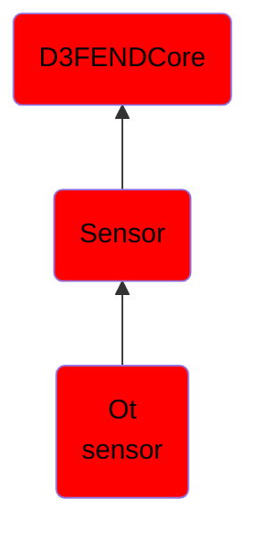

# Ot sensor

## Overview

### Definition
An OT Sensor is an industrial-grade sensing device engineered for operational technology (OT) environments (e.g. SCADA, ICS). It measures physical variables—such as pressure, temperature, or flow—under demanding conditions, converting them into reliable signals for real-time monitoring and process control loops.

### Examples
Not defined.

### Aliases
Not defined.

### URI
http://d3fend.mitre.org/ontologies/d3fend.owl#OTSensor

### Subclass Of

- [D3FENDCore](/docs/ontology/reference/model/D3FENDCore/D3FENDCore.md)
- [Sensor](/docs/ontology/reference/model/D3FENDCore/Sensor/Sensor.md)
- [Ot sensor](/docs/ontology/reference/model/D3FENDCore/Sensor/Ot%20sensor/Ot%20sensor.md)

### Ontology Reference
- [d3fend](http://d3fend.mitre.org/ontologies/d3fend.owl#)

## Properties
