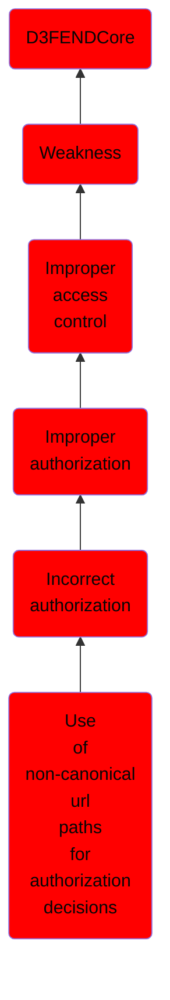

# Use of non-canonical url paths for authorization decisions

## Overview

### Definition
Not defined.

### Examples
Not defined.

### Aliases
Not defined.

### URI
http://d3fend.mitre.org/ontologies/d3fend.owl#CWE-647

### Subclass Of

- [D3FENDCore](/docs/ontology/reference/model/D3FENDCore/D3FENDCore.md)
- [Weakness](/docs/ontology/reference/model/D3FENDCore/Weakness/Weakness.md)
- [Improper access control](/docs/ontology/reference/model/D3FENDCore/Weakness/Improper%20access%20control/Improper%20access%20control.md)
- [Improper authorization](/docs/ontology/reference/model/D3FENDCore/Weakness/Improper%20access%20control/Improper%20authorization/Improper%20authorization.md)
- [Incorrect authorization](/docs/ontology/reference/model/D3FENDCore/Weakness/Improper%20access%20control/Improper%20authorization/Incorrect%20authorization/Incorrect%20authorization.md)
- [Use of non-canonical url paths for authorization decisions](/docs/ontology/reference/model/D3FENDCore/Weakness/Improper%20access%20control/Improper%20authorization/Incorrect%20authorization/Use%20of%20non-canonical%20url%20paths%20for%20authorization%20decisions/Use%20of%20non-canonical%20url%20paths%20for%20authorization%20decisions.md)

### Ontology Reference
- [d3fend](http://d3fend.mitre.org/ontologies/d3fend.owl#)

## Properties
### Object Properties
| Ontology | Label | Definition | Example | Domain | Range | Inverse Of |
|----------|-------|------------|---------|--------|-------|------------|
| d3fend | [may-be-weakness-of](http://d3fend.mitre.org/ontologies/d3fend.owl#may-be-weakness-of) |  |  | [Weakness](/docs/ontology/reference/model/D3FENDCore/Weakness/Weakness.md) | [Artifact](/docs/ontology/reference/model/D3FENDCore/Artifact/Artifact.md) | [may-have-weakness](http://d3fend.mitre.org/ontologies/d3fend.owl#may-have-weakness) |

