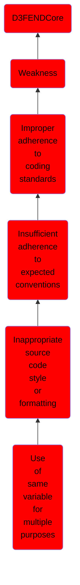

# Use of same variable for multiple purposes

## Overview

### Definition
Not defined.

### Examples
Not defined.

### Aliases
Not defined.

### URI
http://d3fend.mitre.org/ontologies/d3fend.owl#CWE-1109

### Subclass Of

- [D3FENDCore](/docs/ontology/reference/model/D3FENDCore/D3FENDCore.md)
- [Weakness](/docs/ontology/reference/model/D3FENDCore/Weakness/Weakness.md)
- [Improper adherence to coding standards](/docs/ontology/reference/model/D3FENDCore/Weakness/Improper%20adherence%20to%20coding%20standards/Improper%20adherence%20to%20coding%20standards.md)
- [Insufficient adherence to expected conventions](/docs/ontology/reference/model/D3FENDCore/Weakness/Improper%20adherence%20to%20coding%20standards/Insufficient%20adherence%20to%20expected%20conventions/Insufficient%20adherence%20to%20expected%20conventions.md)
- [Inappropriate source code style or formatting](/docs/ontology/reference/model/D3FENDCore/Weakness/Improper%20adherence%20to%20coding%20standards/Insufficient%20adherence%20to%20expected%20conventions/Inappropriate%20source%20code%20style%20or%20formatting/Inappropriate%20source%20code%20style%20or%20formatting.md)
- [Use of same variable for multiple purposes](/docs/ontology/reference/model/D3FENDCore/Weakness/Improper%20adherence%20to%20coding%20standards/Insufficient%20adherence%20to%20expected%20conventions/Inappropriate%20source%20code%20style%20or%20formatting/Use%20of%20same%20variable%20for%20multiple%20purposes/Use%20of%20same%20variable%20for%20multiple%20purposes.md)

### Ontology Reference
- [d3fend](http://d3fend.mitre.org/ontologies/d3fend.owl#)

## Properties
### Object Properties
| Ontology | Label | Definition | Example | Domain | Range | Inverse Of |
|----------|-------|------------|---------|--------|-------|------------|
| d3fend | [may-be-weakness-of](http://d3fend.mitre.org/ontologies/d3fend.owl#may-be-weakness-of) |  |  | [Weakness](/docs/ontology/reference/model/D3FENDCore/Weakness/Weakness.md) | [Artifact](/docs/ontology/reference/model/D3FENDCore/Artifact/Artifact.md) | [may-have-weakness](http://d3fend.mitre.org/ontologies/d3fend.owl#may-have-weakness) |

