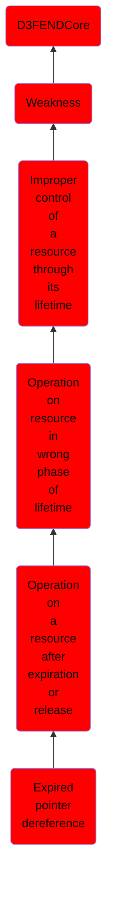

# Expired pointer dereference

## Overview

### Definition
Not defined.

### Examples
Not defined.

### Aliases
Not defined.

### URI
http://d3fend.mitre.org/ontologies/d3fend.owl#CWE-825

### Subclass Of

- [D3FENDCore](/docs/ontology/reference/model/D3FENDCore/D3FENDCore.md)
- [Weakness](/docs/ontology/reference/model/D3FENDCore/Weakness/Weakness.md)
- [Improper control of a resource through its lifetime](/docs/ontology/reference/model/D3FENDCore/Weakness/Improper%20control%20of%20a%20resource%20through%20its%20lifetime/Improper%20control%20of%20a%20resource%20through%20its%20lifetime.md)
- [Operation on resource in wrong phase of lifetime](/docs/ontology/reference/model/D3FENDCore/Weakness/Improper%20control%20of%20a%20resource%20through%20its%20lifetime/Operation%20on%20resource%20in%20wrong%20phase%20of%20lifetime/Operation%20on%20resource%20in%20wrong%20phase%20of%20lifetime.md)
- [Operation on a resource after expiration or release](/docs/ontology/reference/model/D3FENDCore/Weakness/Improper%20control%20of%20a%20resource%20through%20its%20lifetime/Operation%20on%20resource%20in%20wrong%20phase%20of%20lifetime/Operation%20on%20a%20resource%20after%20expiration%20or%20release/Operation%20on%20a%20resource%20after%20expiration%20or%20release.md)
- [Expired pointer dereference](/docs/ontology/reference/model/D3FENDCore/Weakness/Improper%20control%20of%20a%20resource%20through%20its%20lifetime/Operation%20on%20resource%20in%20wrong%20phase%20of%20lifetime/Operation%20on%20a%20resource%20after%20expiration%20or%20release/Expired%20pointer%20dereference/Expired%20pointer%20dereference.md)

### Ontology Reference
- [d3fend](http://d3fend.mitre.org/ontologies/d3fend.owl#)

## Properties
### Object Properties
| Ontology | Label | Definition | Example | Domain | Range | Inverse Of |
|----------|-------|------------|---------|--------|-------|------------|
| d3fend | [may-be-weakness-of](http://d3fend.mitre.org/ontologies/d3fend.owl#may-be-weakness-of) |  |  | [Weakness](/docs/ontology/reference/model/D3FENDCore/Weakness/Weakness.md) | [Artifact](/docs/ontology/reference/model/D3FENDCore/Artifact/Artifact.md) | [may-have-weakness](http://d3fend.mitre.org/ontologies/d3fend.owl#may-have-weakness) |

