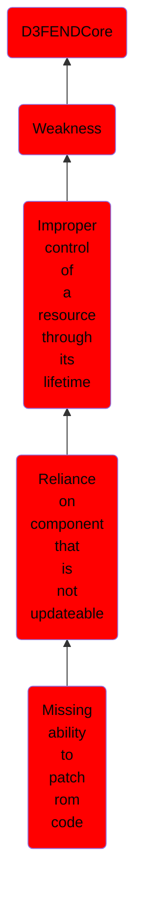

# Missing ability to patch rom code

## Overview

### Definition
Not defined.

### Examples
Not defined.

### Aliases
Not defined.

### URI
http://d3fend.mitre.org/ontologies/d3fend.owl#CWE-1310

### Subclass Of

- [D3FENDCore](/docs/ontology/reference/model/D3FENDCore/D3FENDCore.md)
- [Weakness](/docs/ontology/reference/model/D3FENDCore/Weakness/Weakness.md)
- [Improper control of a resource through its lifetime](/docs/ontology/reference/model/D3FENDCore/Weakness/Improper%20control%20of%20a%20resource%20through%20its%20lifetime/Improper%20control%20of%20a%20resource%20through%20its%20lifetime.md)
- [Reliance on component that is not updateable](/docs/ontology/reference/model/D3FENDCore/Weakness/Improper%20control%20of%20a%20resource%20through%20its%20lifetime/Reliance%20on%20component%20that%20is%20not%20updateable/Reliance%20on%20component%20that%20is%20not%20updateable.md)
- [Missing ability to patch rom code](/docs/ontology/reference/model/D3FENDCore/Weakness/Improper%20control%20of%20a%20resource%20through%20its%20lifetime/Reliance%20on%20component%20that%20is%20not%20updateable/Missing%20ability%20to%20patch%20rom%20code/Missing%20ability%20to%20patch%20rom%20code.md)

### Ontology Reference
- [d3fend](http://d3fend.mitre.org/ontologies/d3fend.owl#)

## Properties
### Object Properties
| Ontology | Label | Definition | Example | Domain | Range | Inverse Of |
|----------|-------|------------|---------|--------|-------|------------|
| d3fend | [may-be-weakness-of](http://d3fend.mitre.org/ontologies/d3fend.owl#may-be-weakness-of) |  |  | [Weakness](/docs/ontology/reference/model/D3FENDCore/Weakness/Weakness.md) | [Artifact](/docs/ontology/reference/model/D3FENDCore/Artifact/Artifact.md) | [may-have-weakness](http://d3fend.mitre.org/ontologies/d3fend.owl#may-have-weakness) |

