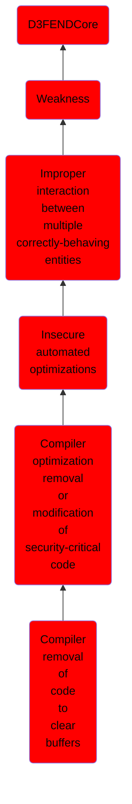

# Compiler removal of code to clear buffers

## Overview

### Definition
Not defined.

### Examples
Not defined.

### Aliases
Not defined.

### URI
http://d3fend.mitre.org/ontologies/d3fend.owl#CWE-14

### Subclass Of

- [D3FENDCore](/docs/ontology/reference/model/D3FENDCore/D3FENDCore.md)
- [Weakness](/docs/ontology/reference/model/D3FENDCore/Weakness/Weakness.md)
- [Improper interaction between multiple correctly-behaving entities](/docs/ontology/reference/model/D3FENDCore/Weakness/Improper%20interaction%20between%20multiple%20correctly-behaving%20entities/Improper%20interaction%20between%20multiple%20correctly-behaving%20entities.md)
- [Insecure automated optimizations](/docs/ontology/reference/model/D3FENDCore/Weakness/Improper%20interaction%20between%20multiple%20correctly-behaving%20entities/Insecure%20automated%20optimizations/Insecure%20automated%20optimizations.md)
- [Compiler optimization removal or modification of security-critical code](/docs/ontology/reference/model/D3FENDCore/Weakness/Improper%20interaction%20between%20multiple%20correctly-behaving%20entities/Insecure%20automated%20optimizations/Compiler%20optimization%20removal%20or%20modification%20of%20security-critical%20code/Compiler%20optimization%20removal%20or%20modification%20of%20security-critical%20code.md)
- [Compiler removal of code to clear buffers](/docs/ontology/reference/model/D3FENDCore/Weakness/Improper%20interaction%20between%20multiple%20correctly-behaving%20entities/Insecure%20automated%20optimizations/Compiler%20optimization%20removal%20or%20modification%20of%20security-critical%20code/Compiler%20removal%20of%20code%20to%20clear%20buffers/Compiler%20removal%20of%20code%20to%20clear%20buffers.md)

### Ontology Reference
- [d3fend](http://d3fend.mitre.org/ontologies/d3fend.owl#)

## Properties
### Object Properties
| Ontology | Label | Definition | Example | Domain | Range | Inverse Of |
|----------|-------|------------|---------|--------|-------|------------|
| d3fend | [may-be-weakness-of](http://d3fend.mitre.org/ontologies/d3fend.owl#may-be-weakness-of) |  |  | [Weakness](/docs/ontology/reference/model/D3FENDCore/Weakness/Weakness.md) | [Artifact](/docs/ontology/reference/model/D3FENDCore/Artifact/Artifact.md) | [may-have-weakness](http://d3fend.mitre.org/ontologies/d3fend.owl#may-have-weakness) |

