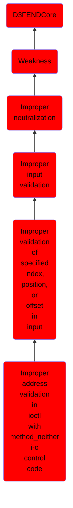

# Improper address validation in ioctl with method_neither i/o control code

## Overview

### Definition
Not defined.

### Examples
Not defined.

### Aliases
Not defined.

### URI
http://d3fend.mitre.org/ontologies/d3fend.owl#CWE-781

### Subclass Of

- [D3FENDCore](/docs/ontology/reference/model/D3FENDCore/D3FENDCore.md)
- [Weakness](/docs/ontology/reference/model/D3FENDCore/Weakness/Weakness.md)
- [Improper neutralization](/docs/ontology/reference/model/D3FENDCore/Weakness/Improper%20neutralization/Improper%20neutralization.md)
- [Improper input validation](/docs/ontology/reference/model/D3FENDCore/Weakness/Improper%20neutralization/Improper%20input%20validation/Improper%20input%20validation.md)
- [Improper validation of specified index, position, or offset in input](/docs/ontology/reference/model/D3FENDCore/Weakness/Improper%20neutralization/Improper%20input%20validation/Improper%20validation%20of%20specified%20index%2C%20position%2C%20or%20offset%20in%20input/Improper%20validation%20of%20specified%20index%2C%20position%2C%20or%20offset%20in%20input.md)
- [Improper address validation in ioctl with method_neither i-o control code](/docs/ontology/reference/model/D3FENDCore/Weakness/Improper%20neutralization/Improper%20input%20validation/Improper%20validation%20of%20specified%20index%2C%20position%2C%20or%20offset%20in%20input/Improper%20address%20validation%20in%20ioctl%20with%20method_neither%20i-o%20control%20code/Improper%20address%20validation%20in%20ioctl%20with%20method_neither%20i-o%20control%20code.md)

### Ontology Reference
- [d3fend](http://d3fend.mitre.org/ontologies/d3fend.owl#)

## Properties
### Object Properties
| Ontology | Label | Definition | Example | Domain | Range | Inverse Of |
|----------|-------|------------|---------|--------|-------|------------|
| d3fend | [may-be-weakness-of](http://d3fend.mitre.org/ontologies/d3fend.owl#may-be-weakness-of) |  |  | [Weakness](/docs/ontology/reference/model/D3FENDCore/Weakness/Weakness.md) | [Artifact](/docs/ontology/reference/model/D3FENDCore/Artifact/Artifact.md) | [may-have-weakness](http://d3fend.mitre.org/ontologies/d3fend.owl#may-have-weakness) |

