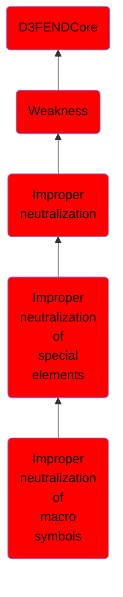

# Improper neutralization of macro symbols

## Overview

### Definition
Not defined.

### Examples
Not defined.

### Aliases
Not defined.

### URI
http://d3fend.mitre.org/ontologies/d3fend.owl#CWE-152

### Subclass Of

- [D3FENDCore](/docs/ontology/reference/model/D3FENDCore/D3FENDCore.md)
- [Weakness](/docs/ontology/reference/model/D3FENDCore/Weakness/Weakness.md)
- [Improper neutralization](/docs/ontology/reference/model/D3FENDCore/Weakness/Improper%20neutralization/Improper%20neutralization.md)
- [Improper neutralization of special elements](/docs/ontology/reference/model/D3FENDCore/Weakness/Improper%20neutralization/Improper%20neutralization%20of%20special%20elements/Improper%20neutralization%20of%20special%20elements.md)
- [Improper neutralization of macro symbols](/docs/ontology/reference/model/D3FENDCore/Weakness/Improper%20neutralization/Improper%20neutralization%20of%20special%20elements/Improper%20neutralization%20of%20macro%20symbols/Improper%20neutralization%20of%20macro%20symbols.md)

### Ontology Reference
- [d3fend](http://d3fend.mitre.org/ontologies/d3fend.owl#)

## Properties
### Object Properties
| Ontology | Label | Definition | Example | Domain | Range | Inverse Of |
|----------|-------|------------|---------|--------|-------|------------|
| d3fend | [may-be-weakness-of](http://d3fend.mitre.org/ontologies/d3fend.owl#may-be-weakness-of) |  |  | [Weakness](/docs/ontology/reference/model/D3FENDCore/Weakness/Weakness.md) | [Artifact](/docs/ontology/reference/model/D3FENDCore/Artifact/Artifact.md) | [may-have-weakness](http://d3fend.mitre.org/ontologies/d3fend.owl#may-have-weakness) |

