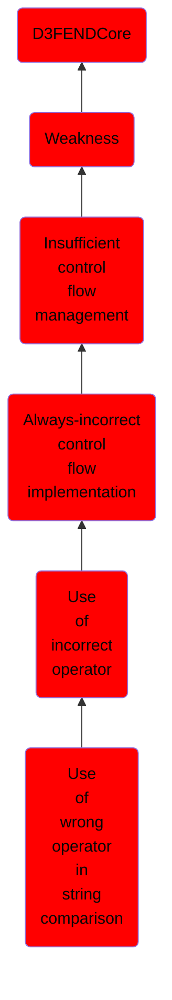

# Use of wrong operator in string comparison

## Overview

### Definition
Not defined.

### Examples
Not defined.

### Aliases
Not defined.

### URI
http://d3fend.mitre.org/ontologies/d3fend.owl#CWE-597

### Subclass Of

- [D3FENDCore](/docs/ontology/reference/model/D3FENDCore/D3FENDCore.md)
- [Weakness](/docs/ontology/reference/model/D3FENDCore/Weakness/Weakness.md)
- [Insufficient control flow management](/docs/ontology/reference/model/D3FENDCore/Weakness/Insufficient%20control%20flow%20management/Insufficient%20control%20flow%20management.md)
- [Always-incorrect control flow implementation](/docs/ontology/reference/model/D3FENDCore/Weakness/Insufficient%20control%20flow%20management/Always-incorrect%20control%20flow%20implementation/Always-incorrect%20control%20flow%20implementation.md)
- [Use of incorrect operator](/docs/ontology/reference/model/D3FENDCore/Weakness/Insufficient%20control%20flow%20management/Always-incorrect%20control%20flow%20implementation/Use%20of%20incorrect%20operator/Use%20of%20incorrect%20operator.md)
- [Use of wrong operator in string comparison](/docs/ontology/reference/model/D3FENDCore/Weakness/Insufficient%20control%20flow%20management/Always-incorrect%20control%20flow%20implementation/Use%20of%20incorrect%20operator/Use%20of%20wrong%20operator%20in%20string%20comparison/Use%20of%20wrong%20operator%20in%20string%20comparison.md)

### Ontology Reference
- [d3fend](http://d3fend.mitre.org/ontologies/d3fend.owl#)

## Properties
### Object Properties
| Ontology | Label | Definition | Example | Domain | Range | Inverse Of |
|----------|-------|------------|---------|--------|-------|------------|
| d3fend | [may-be-weakness-of](http://d3fend.mitre.org/ontologies/d3fend.owl#may-be-weakness-of) |  |  | [Weakness](/docs/ontology/reference/model/D3FENDCore/Weakness/Weakness.md) | [Artifact](/docs/ontology/reference/model/D3FENDCore/Artifact/Artifact.md) | [may-have-weakness](http://d3fend.mitre.org/ontologies/d3fend.owl#may-have-weakness) |

