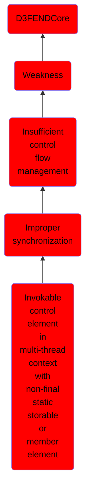

# Invokable control element in multi-thread context with non-final static storable or member element

## Overview

### Definition
Not defined.

### Examples
Not defined.

### Aliases
Not defined.

### URI
http://d3fend.mitre.org/ontologies/d3fend.owl#CWE-1058

### Subclass Of

- [D3FENDCore](/docs/ontology/reference/model/D3FENDCore/D3FENDCore.md)
- [Weakness](/docs/ontology/reference/model/D3FENDCore/Weakness/Weakness.md)
- [Insufficient control flow management](/docs/ontology/reference/model/D3FENDCore/Weakness/Insufficient%20control%20flow%20management/Insufficient%20control%20flow%20management.md)
- [Improper synchronization](/docs/ontology/reference/model/D3FENDCore/Weakness/Insufficient%20control%20flow%20management/Improper%20synchronization/Improper%20synchronization.md)
- [Invokable control element in multi-thread context with non-final static storable or member element](/docs/ontology/reference/model/D3FENDCore/Weakness/Insufficient%20control%20flow%20management/Improper%20synchronization/Invokable%20control%20element%20in%20multi-thread%20context%20with%20non-final%20static%20storable%20or%20member%20element/Invokable%20control%20element%20in%20multi-thread%20context%20with%20non-final%20static%20storable%20or%20member%20element.md)

### Ontology Reference
- [d3fend](http://d3fend.mitre.org/ontologies/d3fend.owl#)

## Properties
### Object Properties
| Ontology | Label | Definition | Example | Domain | Range | Inverse Of |
|----------|-------|------------|---------|--------|-------|------------|
| d3fend | [may-be-weakness-of](http://d3fend.mitre.org/ontologies/d3fend.owl#may-be-weakness-of) |  |  | [Weakness](/docs/ontology/reference/model/D3FENDCore/Weakness/Weakness.md) | [Artifact](/docs/ontology/reference/model/D3FENDCore/Artifact/Artifact.md) | [may-have-weakness](http://d3fend.mitre.org/ontologies/d3fend.owl#may-have-weakness) |

