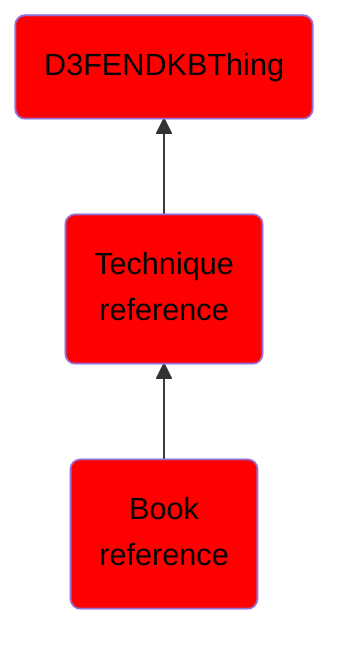

# Book reference

## Overview

### Definition
Not defined.

### Examples
Not defined.

### Aliases
Not defined.

### URI
http://d3fend.mitre.org/ontologies/d3fend.owl#BookReference

### Subclass Of

- [D3FENDKBThing](/docs/ontology/reference/model/D3FENDKBThing/D3FENDKBThing.md)
- [Technique reference](/docs/ontology/reference/model/D3FENDKBThing/Technique%20reference/Technique%20reference.md)
- [Book reference](/docs/ontology/reference/model/D3FENDKBThing/Technique%20reference/Book%20reference/Book%20reference.md)

### Ontology Reference
- [d3fend](http://d3fend.mitre.org/ontologies/d3fend.owl#)

## Properties
