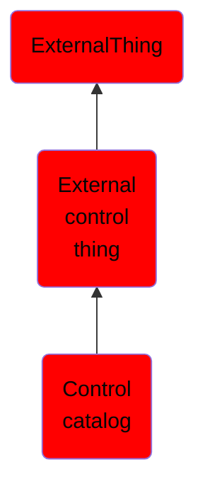

# Control catalog

## Overview

### Definition
A control catalog is a complete list of protective measures for systems, organizations, or individuals for subject domains (e.g., security and privacy.)

### Examples
Not defined.

### Aliases
Not defined.

### URI
http://d3fend.mitre.org/ontologies/d3fend.owl#ControlCatalog

### Subclass Of

- [ExternalThing](/docs/ontology/reference/model/ExternalThing/ExternalThing.md)
- [External control thing](/docs/ontology/reference/model/ExternalThing/External%20control%20thing/External%20control%20thing.md)
- [Control catalog](/docs/ontology/reference/model/ExternalThing/External%20control%20thing/Control%20catalog/Control%20catalog.md)

### Ontology Reference
- [d3fend](http://d3fend.mitre.org/ontologies/d3fend.owl#)

## Properties
