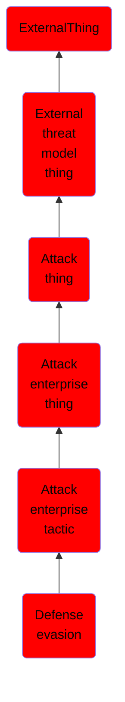

# Defense evasion

## Overview

### Definition
The adversary is trying to avoid being detected.

Defense Evasion consists of techniques that adversaries use to avoid detection throughout their compromise. Techniques used for defense evasion include uninstalling/disabling security software or obfuscating/encrypting data and scripts. Adversaries also leverage and abuse trusted processes to hide and masquerade their malware. Other tactics' techniques are cross-listed here when those techniques include the added benefit of subverting defenses.

### Examples
Not defined.

### Aliases
Not defined.

### URI
http://d3fend.mitre.org/ontologies/d3fend.owl#TA0005

### Subclass Of

- [ExternalThing](/docs/ontology/reference/model/ExternalThing/ExternalThing.md)
- [External threat model thing](/docs/ontology/reference/model/ExternalThing/External%20threat%20model%20thing/External%20threat%20model%20thing.md)
- [Attack thing](/docs/ontology/reference/model/ExternalThing/External%20threat%20model%20thing/Attack%20thing/Attack%20thing.md)
- [Attack enterprise thing](/docs/ontology/reference/model/ExternalThing/External%20threat%20model%20thing/Attack%20thing/Attack%20enterprise%20thing/Attack%20enterprise%20thing.md)
- [Attack enterprise tactic](/docs/ontology/reference/model/ExternalThing/External%20threat%20model%20thing/Attack%20thing/Attack%20enterprise%20thing/Attack%20enterprise%20tactic/Attack%20enterprise%20tactic.md)
- [Defense evasion](/docs/ontology/reference/model/ExternalThing/External%20threat%20model%20thing/Attack%20thing/Attack%20enterprise%20thing/Attack%20enterprise%20tactic/Defense%20evasion/Defense%20evasion.md)

### Ontology Reference
- [d3fend](http://d3fend.mitre.org/ontologies/d3fend.owl#)

## Properties
