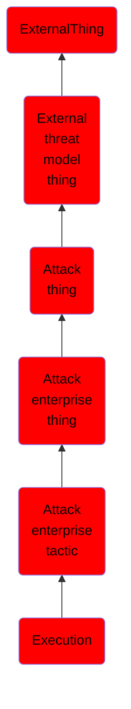

# Execution

## Overview

### Definition
The adversary is trying to run malicious code. 

Execution consists of techniques that result in adversary-controlled code running on a local or remote system. Techniques that run malicious code are often paired with techniques from all other tactics to achieve broader goals, like exploring a network or stealing data. For example, an adversary might use a remote access tool to run a PowerShell script that does Remote System Discovery.

### Examples
Not defined.

### Aliases
Not defined.

### URI
http://d3fend.mitre.org/ontologies/d3fend.owl#TA0002

### Subclass Of

- [ExternalThing](/docs/ontology/reference/model/ExternalThing/ExternalThing.md)
- [External threat model thing](/docs/ontology/reference/model/ExternalThing/External%20threat%20model%20thing/External%20threat%20model%20thing.md)
- [Attack thing](/docs/ontology/reference/model/ExternalThing/External%20threat%20model%20thing/Attack%20thing/Attack%20thing.md)
- [Attack enterprise thing](/docs/ontology/reference/model/ExternalThing/External%20threat%20model%20thing/Attack%20thing/Attack%20enterprise%20thing/Attack%20enterprise%20thing.md)
- [Attack enterprise tactic](/docs/ontology/reference/model/ExternalThing/External%20threat%20model%20thing/Attack%20thing/Attack%20enterprise%20thing/Attack%20enterprise%20tactic/Attack%20enterprise%20tactic.md)
- [Execution](/docs/ontology/reference/model/ExternalThing/External%20threat%20model%20thing/Attack%20thing/Attack%20enterprise%20thing/Attack%20enterprise%20tactic/Execution/Execution.md)

### Ontology Reference
- [d3fend](http://d3fend.mitre.org/ontologies/d3fend.owl#)

## Properties
