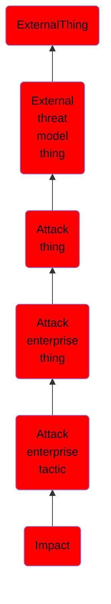

# Impact

## Overview

### Definition
The adversary is trying to manipulate, interrupt, or destroy your systems and data.

Impact consists of techniques that adversaries use to disrupt availability or compromise integrity by manipulating business and operational processes. Techniques used for impact can include destroying or tampering with data. In some cases, business processes can look fine, but may have been altered to benefit the adversaries' goals. These techniques might be used by adversaries to follow through on their end goal or to provide cover for a confidentiality breach.

### Examples
Not defined.

### Aliases
Not defined.

### URI
http://d3fend.mitre.org/ontologies/d3fend.owl#TA0040

### Subclass Of

- [ExternalThing](/docs/ontology/reference/model/ExternalThing/ExternalThing.md)
- [External threat model thing](/docs/ontology/reference/model/ExternalThing/External%20threat%20model%20thing/External%20threat%20model%20thing.md)
- [Attack thing](/docs/ontology/reference/model/ExternalThing/External%20threat%20model%20thing/Attack%20thing/Attack%20thing.md)
- [Attack enterprise thing](/docs/ontology/reference/model/ExternalThing/External%20threat%20model%20thing/Attack%20thing/Attack%20enterprise%20thing/Attack%20enterprise%20thing.md)
- [Attack enterprise tactic](/docs/ontology/reference/model/ExternalThing/External%20threat%20model%20thing/Attack%20thing/Attack%20enterprise%20thing/Attack%20enterprise%20tactic/Attack%20enterprise%20tactic.md)
- [Impact](/docs/ontology/reference/model/ExternalThing/External%20threat%20model%20thing/Attack%20thing/Attack%20enterprise%20thing/Attack%20enterprise%20tactic/Impact/Impact.md)

### Ontology Reference
- [d3fend](http://d3fend.mitre.org/ontologies/d3fend.owl#)

## Properties
