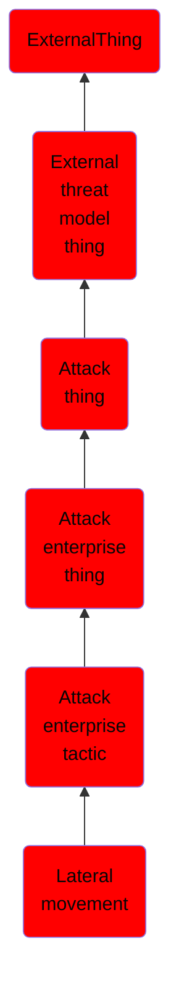

# Lateral movement

## Overview

### Definition
The adversary is trying to move through your environment.

Lateral Movement consists of techniques that adversaries use to enter and control remote systems on a network. Following through on their primary objective often requires exploring the network to find their target and subsequently gaining access to it. Reaching their objective often involves pivoting through multiple systems and accounts to gain. Adversaries might install their own remote access tools to accomplish Lateral Movement or use legitimate credentials with native network and operating system tools, which may be stealthier.

### Examples
Not defined.

### Aliases
Not defined.

### URI
http://d3fend.mitre.org/ontologies/d3fend.owl#TA0008

### Subclass Of

- [ExternalThing](/docs/ontology/reference/model/ExternalThing/ExternalThing.md)
- [External threat model thing](/docs/ontology/reference/model/ExternalThing/External%20threat%20model%20thing/External%20threat%20model%20thing.md)
- [Attack thing](/docs/ontology/reference/model/ExternalThing/External%20threat%20model%20thing/Attack%20thing/Attack%20thing.md)
- [Attack enterprise thing](/docs/ontology/reference/model/ExternalThing/External%20threat%20model%20thing/Attack%20thing/Attack%20enterprise%20thing/Attack%20enterprise%20thing.md)
- [Attack enterprise tactic](/docs/ontology/reference/model/ExternalThing/External%20threat%20model%20thing/Attack%20thing/Attack%20enterprise%20thing/Attack%20enterprise%20tactic/Attack%20enterprise%20tactic.md)
- [Lateral movement](/docs/ontology/reference/model/ExternalThing/External%20threat%20model%20thing/Attack%20thing/Attack%20enterprise%20thing/Attack%20enterprise%20tactic/Lateral%20movement/Lateral%20movement.md)

### Ontology Reference
- [d3fend](http://d3fend.mitre.org/ontologies/d3fend.owl#)

## Properties
