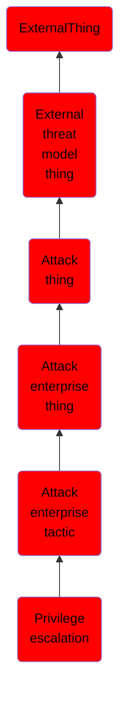

# Privilege escalation

## Overview

### Definition
The adversary is trying to gain higher-level permissions.

Privilege Escalation consists of techniques that adversaries use to gain higher-level permissions on a system or network. Adversaries can often enter and explore a network with unprivileged access but require elevated permissions to follow through on their objectives. Common approaches are to take advantage of system weaknesses, misconfigurations, and vulnerabilities. Examples of elevated access include:

SYSTEM/root level
local administrator
user account with admin-like access
user accounts with access to specific system or perform specific function

These techniques often overlap with Persistence techniques, as OS features that let an adversary persist can execute in an elevated context.

### Examples
Not defined.

### Aliases
Not defined.

### URI
http://d3fend.mitre.org/ontologies/d3fend.owl#TA0004

### Subclass Of

- [ExternalThing](/docs/ontology/reference/model/ExternalThing/ExternalThing.md)
- [External threat model thing](/docs/ontology/reference/model/ExternalThing/External%20threat%20model%20thing/External%20threat%20model%20thing.md)
- [Attack thing](/docs/ontology/reference/model/ExternalThing/External%20threat%20model%20thing/Attack%20thing/Attack%20thing.md)
- [Attack enterprise thing](/docs/ontology/reference/model/ExternalThing/External%20threat%20model%20thing/Attack%20thing/Attack%20enterprise%20thing/Attack%20enterprise%20thing.md)
- [Attack enterprise tactic](/docs/ontology/reference/model/ExternalThing/External%20threat%20model%20thing/Attack%20thing/Attack%20enterprise%20thing/Attack%20enterprise%20tactic/Attack%20enterprise%20tactic.md)
- [Privilege escalation](/docs/ontology/reference/model/ExternalThing/External%20threat%20model%20thing/Attack%20thing/Attack%20enterprise%20thing/Attack%20enterprise%20tactic/Privilege%20escalation/Privilege%20escalation.md)

### Ontology Reference
- [d3fend](http://d3fend.mitre.org/ontologies/d3fend.owl#)

## Properties
