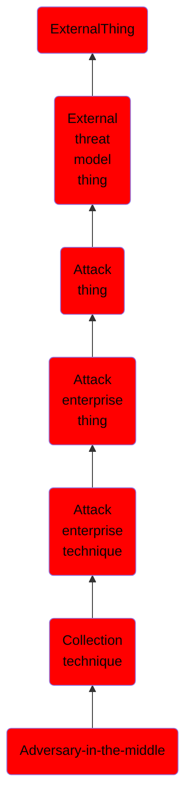

# Adversary-in-the-middle

## Overview

### Definition
Adversaries may attempt to position themselves between two or more networked devices using an adversary-in-the-middle (AiTM) technique to support follow-on behaviors such as [Network Sniffing](https://attack.mitre.org/techniques/T1040), [Transmitted Data Manipulation](https://attack.mitre.org/techniques/T1565/002), or replay attacks ([Exploitation for Credential Access](https://attack.mitre.org/techniques/T1212)). By abusing features of common networking protocols that can determine the flow of network traffic (e.g. ARP, DNS, LLMNR, etc.), adversaries may force a device to communicate through an adversary controlled system so they can collect information or perform additional actions.(Citation: Rapid7 MiTM Basics)

### Examples
Not defined.

### Aliases
Not defined.

### URI
http://d3fend.mitre.org/ontologies/d3fend.owl#T1557

### Subclass Of

- [ExternalThing](/docs/ontology/reference/model/ExternalThing/ExternalThing.md)
- [External threat model thing](/docs/ontology/reference/model/ExternalThing/External%20threat%20model%20thing/External%20threat%20model%20thing.md)
- [Attack thing](/docs/ontology/reference/model/ExternalThing/External%20threat%20model%20thing/Attack%20thing/Attack%20thing.md)
- [Attack enterprise thing](/docs/ontology/reference/model/ExternalThing/External%20threat%20model%20thing/Attack%20thing/Attack%20enterprise%20thing/Attack%20enterprise%20thing.md)
- [Attack enterprise technique](/docs/ontology/reference/model/ExternalThing/External%20threat%20model%20thing/Attack%20thing/Attack%20enterprise%20thing/Attack%20enterprise%20technique/Attack%20enterprise%20technique.md)
- [Collection technique](/docs/ontology/reference/model/ExternalThing/External%20threat%20model%20thing/Attack%20thing/Attack%20enterprise%20thing/Attack%20enterprise%20technique/Collection%20technique/Collection%20technique.md)
- [Adversary-in-the-middle](/docs/ontology/reference/model/ExternalThing/External%20threat%20model%20thing/Attack%20thing/Attack%20enterprise%20thing/Attack%20enterprise%20technique/Collection%20technique/Adversary-in-the-middle/Adversary-in-the-middle.md)

### Ontology Reference
- [d3fend](http://d3fend.mitre.org/ontologies/d3fend.owl#)

## Properties
