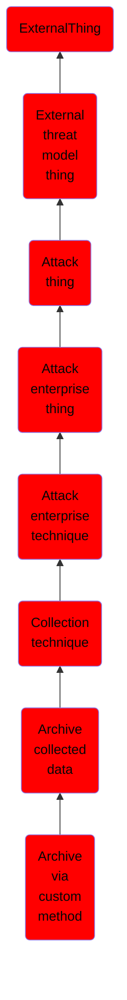

# Archive via custom method

## Overview

### Definition
An adversary may compress or encrypt data that is collected prior to exfiltration using a custom method. Adversaries may choose to use custom archival methods, such as encryption with XOR or stream ciphers implemented with no external library or utility references. Custom implementations of well-known compression algorithms have also been used.(Citation: ESET Sednit Part 2)

### Examples
Not defined.

### Aliases
Not defined.

### URI
http://d3fend.mitre.org/ontologies/d3fend.owl#T1560.003

### Subclass Of

- [ExternalThing](/docs/ontology/reference/model/ExternalThing/ExternalThing.md)
- [External threat model thing](/docs/ontology/reference/model/ExternalThing/External%20threat%20model%20thing/External%20threat%20model%20thing.md)
- [Attack thing](/docs/ontology/reference/model/ExternalThing/External%20threat%20model%20thing/Attack%20thing/Attack%20thing.md)
- [Attack enterprise thing](/docs/ontology/reference/model/ExternalThing/External%20threat%20model%20thing/Attack%20thing/Attack%20enterprise%20thing/Attack%20enterprise%20thing.md)
- [Attack enterprise technique](/docs/ontology/reference/model/ExternalThing/External%20threat%20model%20thing/Attack%20thing/Attack%20enterprise%20thing/Attack%20enterprise%20technique/Attack%20enterprise%20technique.md)
- [Collection technique](/docs/ontology/reference/model/ExternalThing/External%20threat%20model%20thing/Attack%20thing/Attack%20enterprise%20thing/Attack%20enterprise%20technique/Collection%20technique/Collection%20technique.md)
- [Archive collected data](/docs/ontology/reference/model/ExternalThing/External%20threat%20model%20thing/Attack%20thing/Attack%20enterprise%20thing/Attack%20enterprise%20technique/Collection%20technique/Archive%20collected%20data/Archive%20collected%20data.md)
- [Archive via custom method](/docs/ontology/reference/model/ExternalThing/External%20threat%20model%20thing/Attack%20thing/Attack%20enterprise%20thing/Attack%20enterprise%20technique/Collection%20technique/Archive%20collected%20data/Archive%20via%20custom%20method/Archive%20via%20custom%20method.md)

### Ontology Reference
- [d3fend](http://d3fend.mitre.org/ontologies/d3fend.owl#)

## Properties
