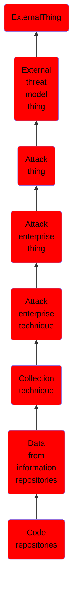

# Code repositories

## Overview

### Definition
Adversaries may leverage code repositories to collect valuable information. Code repositories are tools/services that store source code and automate software builds. They may be hosted internally or privately on third party sites such as Github, GitLab, SourceForge, and BitBucket. Users typically interact with code repositories through a web application or command-line utilities such as git.

### Examples
Not defined.

### Aliases
Not defined.

### URI
http://d3fend.mitre.org/ontologies/d3fend.owl#T1213.003

### Subclass Of

- [ExternalThing](/docs/ontology/reference/model/ExternalThing/ExternalThing.md)
- [External threat model thing](/docs/ontology/reference/model/ExternalThing/External%20threat%20model%20thing/External%20threat%20model%20thing.md)
- [Attack thing](/docs/ontology/reference/model/ExternalThing/External%20threat%20model%20thing/Attack%20thing/Attack%20thing.md)
- [Attack enterprise thing](/docs/ontology/reference/model/ExternalThing/External%20threat%20model%20thing/Attack%20thing/Attack%20enterprise%20thing/Attack%20enterprise%20thing.md)
- [Attack enterprise technique](/docs/ontology/reference/model/ExternalThing/External%20threat%20model%20thing/Attack%20thing/Attack%20enterprise%20thing/Attack%20enterprise%20technique/Attack%20enterprise%20technique.md)
- [Collection technique](/docs/ontology/reference/model/ExternalThing/External%20threat%20model%20thing/Attack%20thing/Attack%20enterprise%20thing/Attack%20enterprise%20technique/Collection%20technique/Collection%20technique.md)
- [Data from information repositories](/docs/ontology/reference/model/ExternalThing/External%20threat%20model%20thing/Attack%20thing/Attack%20enterprise%20thing/Attack%20enterprise%20technique/Collection%20technique/Data%20from%20information%20repositories/Data%20from%20information%20repositories.md)
- [Code repositories](/docs/ontology/reference/model/ExternalThing/External%20threat%20model%20thing/Attack%20thing/Attack%20enterprise%20thing/Attack%20enterprise%20technique/Collection%20technique/Data%20from%20information%20repositories/Code%20repositories/Code%20repositories.md)

### Ontology Reference
- [d3fend](http://d3fend.mitre.org/ontologies/d3fend.owl#)

## Properties
