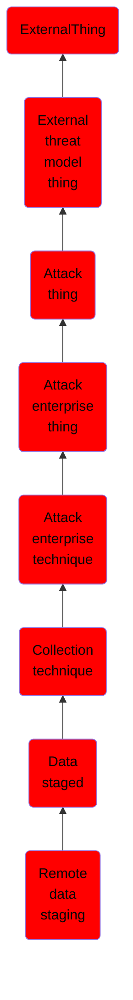

# Remote data staging

## Overview

### Definition
Adversaries may stage data collected from multiple systems in a central location or directory on one system prior to Exfiltration. Data may be kept in separate files or combined into one file through techniques such as [Archive Collected Data](https://attack.mitre.org/techniques/T1560). Interactive command shells may be used, and common functionality within [cmd](https://attack.mitre.org/software/S0106) and bash may be used to copy data into a staging location.

### Examples
Not defined.

### Aliases
Not defined.

### URI
http://d3fend.mitre.org/ontologies/d3fend.owl#T1074.002

### Subclass Of

- [ExternalThing](/docs/ontology/reference/model/ExternalThing/ExternalThing.md)
- [External threat model thing](/docs/ontology/reference/model/ExternalThing/External%20threat%20model%20thing/External%20threat%20model%20thing.md)
- [Attack thing](/docs/ontology/reference/model/ExternalThing/External%20threat%20model%20thing/Attack%20thing/Attack%20thing.md)
- [Attack enterprise thing](/docs/ontology/reference/model/ExternalThing/External%20threat%20model%20thing/Attack%20thing/Attack%20enterprise%20thing/Attack%20enterprise%20thing.md)
- [Attack enterprise technique](/docs/ontology/reference/model/ExternalThing/External%20threat%20model%20thing/Attack%20thing/Attack%20enterprise%20thing/Attack%20enterprise%20technique/Attack%20enterprise%20technique.md)
- [Collection technique](/docs/ontology/reference/model/ExternalThing/External%20threat%20model%20thing/Attack%20thing/Attack%20enterprise%20thing/Attack%20enterprise%20technique/Collection%20technique/Collection%20technique.md)
- [Data staged](/docs/ontology/reference/model/ExternalThing/External%20threat%20model%20thing/Attack%20thing/Attack%20enterprise%20thing/Attack%20enterprise%20technique/Collection%20technique/Data%20staged/Data%20staged.md)
- [Remote data staging](/docs/ontology/reference/model/ExternalThing/External%20threat%20model%20thing/Attack%20thing/Attack%20enterprise%20thing/Attack%20enterprise%20technique/Collection%20technique/Data%20staged/Remote%20data%20staging/Remote%20data%20staging.md)

### Ontology Reference
- [d3fend](http://d3fend.mitre.org/ontologies/d3fend.owl#)

## Properties
