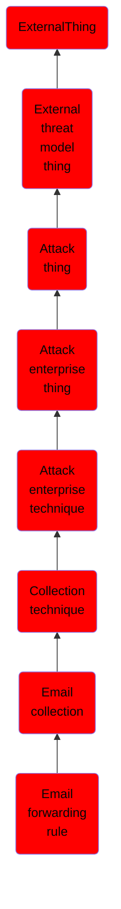

# Email forwarding rule

## Overview

### Definition
Adversaries may setup email forwarding rules to collect sensitive information. Adversaries may abuse email forwarding rules to monitor the activities of a victim, steal information, and further gain intelligence on the victim or the victim’s organization to use as part of further exploits or operations.(Citation: US-CERT TA18-068A 2018) Furthermore, email forwarding rules can allow adversaries to maintain persistent access to victim's emails even after compromised credentials are reset by administrators.(Citation: Pfammatter - Hidden Inbox Rules) Most email clients allow users to create inbox rules for various email functions, including forwarding to a different recipient. These rules may be created through a local email application, a web interface, or by command-line interface. Messages can be forwarded to internal or external recipients, and there are no restrictions limiting the extent of this rule. Administrators may also create forwarding rules for user accounts with the same considerations and outcomes.(Citation: Microsoft Tim McMichael Exchange Mail Forwarding 2)(Citation: Mac Forwarding Rules)

### Examples
Not defined.

### Aliases
Not defined.

### URI
http://d3fend.mitre.org/ontologies/d3fend.owl#T1114.003

### Subclass Of

- [ExternalThing](/docs/ontology/reference/model/ExternalThing/ExternalThing.md)
- [External threat model thing](/docs/ontology/reference/model/ExternalThing/External%20threat%20model%20thing/External%20threat%20model%20thing.md)
- [Attack thing](/docs/ontology/reference/model/ExternalThing/External%20threat%20model%20thing/Attack%20thing/Attack%20thing.md)
- [Attack enterprise thing](/docs/ontology/reference/model/ExternalThing/External%20threat%20model%20thing/Attack%20thing/Attack%20enterprise%20thing/Attack%20enterprise%20thing.md)
- [Attack enterprise technique](/docs/ontology/reference/model/ExternalThing/External%20threat%20model%20thing/Attack%20thing/Attack%20enterprise%20thing/Attack%20enterprise%20technique/Attack%20enterprise%20technique.md)
- [Collection technique](/docs/ontology/reference/model/ExternalThing/External%20threat%20model%20thing/Attack%20thing/Attack%20enterprise%20thing/Attack%20enterprise%20technique/Collection%20technique/Collection%20technique.md)
- [Email collection](/docs/ontology/reference/model/ExternalThing/External%20threat%20model%20thing/Attack%20thing/Attack%20enterprise%20thing/Attack%20enterprise%20technique/Collection%20technique/Email%20collection/Email%20collection.md)
- [Email forwarding rule](/docs/ontology/reference/model/ExternalThing/External%20threat%20model%20thing/Attack%20thing/Attack%20enterprise%20thing/Attack%20enterprise%20technique/Collection%20technique/Email%20collection/Email%20forwarding%20rule/Email%20forwarding%20rule.md)

### Ontology Reference
- [d3fend](http://d3fend.mitre.org/ontologies/d3fend.owl#)

## Properties
