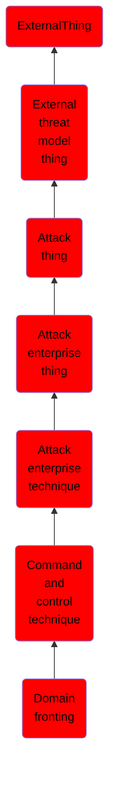

# Domain fronting

## Overview

### Definition
Domain fronting takes advantage of routing schemes in Content Delivery Networks (CDNs) and other services which host multiple domains to obfuscate the intended destination of HTTPS traffic or traffic tunneled through HTTPS. (Citation: Fifield Blocking Resistent Communication through domain fronting 2015) The technique involves using different domain names in the SNI field of the TLS header and the Host field of the HTTP header. If both domains are served from the same CDN, then the CDN may route to the address specified in the HTTP header after unwrapping the TLS header. A variation of the the technique, "domainless" fronting, utilizes a SNI field that is left blank; this may allow the fronting to work even when the CDN attempts to validate that the SNI and HTTP Host fields match (if the blank SNI fields are ignored).

### Examples
Not defined.

### Aliases
Not defined.

### URI
http://d3fend.mitre.org/ontologies/d3fend.owl#T1172

### Subclass Of

- [ExternalThing](/docs/ontology/reference/model/ExternalThing/ExternalThing.md)
- [External threat model thing](/docs/ontology/reference/model/ExternalThing/External%20threat%20model%20thing/External%20threat%20model%20thing.md)
- [Attack thing](/docs/ontology/reference/model/ExternalThing/External%20threat%20model%20thing/Attack%20thing/Attack%20thing.md)
- [Attack enterprise thing](/docs/ontology/reference/model/ExternalThing/External%20threat%20model%20thing/Attack%20thing/Attack%20enterprise%20thing/Attack%20enterprise%20thing.md)
- [Attack enterprise technique](/docs/ontology/reference/model/ExternalThing/External%20threat%20model%20thing/Attack%20thing/Attack%20enterprise%20thing/Attack%20enterprise%20technique/Attack%20enterprise%20technique.md)
- [Command and control technique](/docs/ontology/reference/model/ExternalThing/External%20threat%20model%20thing/Attack%20thing/Attack%20enterprise%20thing/Attack%20enterprise%20technique/Command%20and%20control%20technique/Command%20and%20control%20technique.md)
- [Domain fronting](/docs/ontology/reference/model/ExternalThing/External%20threat%20model%20thing/Attack%20thing/Attack%20enterprise%20thing/Attack%20enterprise%20technique/Command%20and%20control%20technique/Domain%20fronting/Domain%20fronting.md)

### Ontology Reference
- [d3fend](http://d3fend.mitre.org/ontologies/d3fend.owl#)

## Properties
