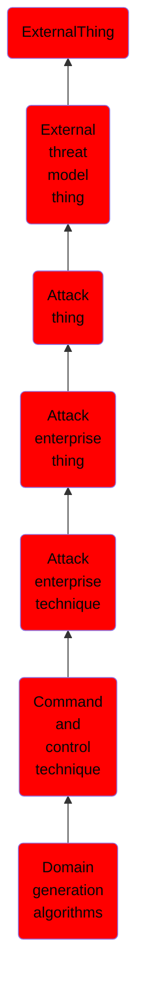

# Domain generation algorithms

## Overview

### Definition
Adversaries may make use of Domain Generation Algorithms (DGAs) to dynamically identify a destination for command and control traffic rather than relying on a list of static IP addresses or domains. This has the advantage of making it much harder for defenders block, track, or take over the command and control channel, as there potentially could be thousands of domains that malware can check for instructions.(Citation: Cybereason Dissecting DGAs)(Citation: Cisco Umbrella DGA)(Citation: Unit 42 DGA Feb 2019)

### Examples
Not defined.

### Aliases
Not defined.

### URI
http://d3fend.mitre.org/ontologies/d3fend.owl#T1483

### Subclass Of

- [ExternalThing](/docs/ontology/reference/model/ExternalThing/ExternalThing.md)
- [External threat model thing](/docs/ontology/reference/model/ExternalThing/External%20threat%20model%20thing/External%20threat%20model%20thing.md)
- [Attack thing](/docs/ontology/reference/model/ExternalThing/External%20threat%20model%20thing/Attack%20thing/Attack%20thing.md)
- [Attack enterprise thing](/docs/ontology/reference/model/ExternalThing/External%20threat%20model%20thing/Attack%20thing/Attack%20enterprise%20thing/Attack%20enterprise%20thing.md)
- [Attack enterprise technique](/docs/ontology/reference/model/ExternalThing/External%20threat%20model%20thing/Attack%20thing/Attack%20enterprise%20thing/Attack%20enterprise%20technique/Attack%20enterprise%20technique.md)
- [Command and control technique](/docs/ontology/reference/model/ExternalThing/External%20threat%20model%20thing/Attack%20thing/Attack%20enterprise%20thing/Attack%20enterprise%20technique/Command%20and%20control%20technique/Command%20and%20control%20technique.md)
- [Domain generation algorithms](/docs/ontology/reference/model/ExternalThing/External%20threat%20model%20thing/Attack%20thing/Attack%20enterprise%20thing/Attack%20enterprise%20technique/Command%20and%20control%20technique/Domain%20generation%20algorithms/Domain%20generation%20algorithms.md)

### Ontology Reference
- [d3fend](http://d3fend.mitre.org/ontologies/d3fend.owl#)

## Properties
