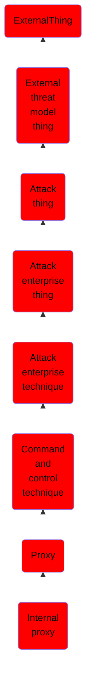

# Internal proxy

## Overview

### Definition
Adversaries may use an internal proxy to direct command and control traffic between two or more systems in a compromised environment. Many tools exist that enable traffic redirection through proxies or port redirection, including [HTRAN](https://attack.mitre.org/software/S0040), ZXProxy, and ZXPortMap. (Citation: Trend Micro APT Attack Tools) Adversaries use internal proxies to manage command and control communications inside a compromised environment, to reduce the number of simultaneous outbound network connections, to provide resiliency in the face of connection loss, or to ride over existing trusted communications paths between infected systems to avoid suspicion. Internal proxy connections may use common peer-to-peer (p2p) networking protocols, such as SMB, to better blend in with the environment.

### Examples
Not defined.

### Aliases
Not defined.

### URI
http://d3fend.mitre.org/ontologies/d3fend.owl#T1090.001

### Subclass Of

- [ExternalThing](/docs/ontology/reference/model/ExternalThing/ExternalThing.md)
- [External threat model thing](/docs/ontology/reference/model/ExternalThing/External%20threat%20model%20thing/External%20threat%20model%20thing.md)
- [Attack thing](/docs/ontology/reference/model/ExternalThing/External%20threat%20model%20thing/Attack%20thing/Attack%20thing.md)
- [Attack enterprise thing](/docs/ontology/reference/model/ExternalThing/External%20threat%20model%20thing/Attack%20thing/Attack%20enterprise%20thing/Attack%20enterprise%20thing.md)
- [Attack enterprise technique](/docs/ontology/reference/model/ExternalThing/External%20threat%20model%20thing/Attack%20thing/Attack%20enterprise%20thing/Attack%20enterprise%20technique/Attack%20enterprise%20technique.md)
- [Command and control technique](/docs/ontology/reference/model/ExternalThing/External%20threat%20model%20thing/Attack%20thing/Attack%20enterprise%20thing/Attack%20enterprise%20technique/Command%20and%20control%20technique/Command%20and%20control%20technique.md)
- [Proxy](/docs/ontology/reference/model/ExternalThing/External%20threat%20model%20thing/Attack%20thing/Attack%20enterprise%20thing/Attack%20enterprise%20technique/Command%20and%20control%20technique/Proxy/Proxy.md)
- [Internal proxy](/docs/ontology/reference/model/ExternalThing/External%20threat%20model%20thing/Attack%20thing/Attack%20enterprise%20thing/Attack%20enterprise%20technique/Command%20and%20control%20technique/Proxy/Internal%20proxy/Internal%20proxy.md)

### Ontology Reference
- [d3fend](http://d3fend.mitre.org/ontologies/d3fend.owl#)

## Properties
