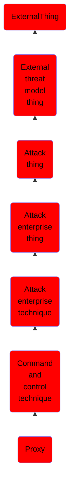

# Proxy

## Overview

### Definition
Adversaries may use a connection proxy to direct network traffic between systems or act as an intermediary for network communications to a command and control server to avoid direct connections to their infrastructure. Many tools exist that enable traffic redirection through proxies or port redirection, including [HTRAN](https://attack.mitre.org/software/S0040), ZXProxy, and ZXPortMap. (Citation: Trend Micro APT Attack Tools) Adversaries use these types of proxies to manage command and control communications, reduce the number of simultaneous outbound network connections, provide resiliency in the face of connection loss, or to ride over existing trusted communications paths between victims to avoid suspicion. Adversaries may chain together multiple proxies to further disguise the source of malicious traffic.

### Examples
Not defined.

### Aliases
Not defined.

### URI
http://d3fend.mitre.org/ontologies/d3fend.owl#T1090

### Subclass Of

- [ExternalThing](/docs/ontology/reference/model/ExternalThing/ExternalThing.md)
- [External threat model thing](/docs/ontology/reference/model/ExternalThing/External%20threat%20model%20thing/External%20threat%20model%20thing.md)
- [Attack thing](/docs/ontology/reference/model/ExternalThing/External%20threat%20model%20thing/Attack%20thing/Attack%20thing.md)
- [Attack enterprise thing](/docs/ontology/reference/model/ExternalThing/External%20threat%20model%20thing/Attack%20thing/Attack%20enterprise%20thing/Attack%20enterprise%20thing.md)
- [Attack enterprise technique](/docs/ontology/reference/model/ExternalThing/External%20threat%20model%20thing/Attack%20thing/Attack%20enterprise%20thing/Attack%20enterprise%20technique/Attack%20enterprise%20technique.md)
- [Command and control technique](/docs/ontology/reference/model/ExternalThing/External%20threat%20model%20thing/Attack%20thing/Attack%20enterprise%20thing/Attack%20enterprise%20technique/Command%20and%20control%20technique/Command%20and%20control%20technique.md)
- [Proxy](/docs/ontology/reference/model/ExternalThing/External%20threat%20model%20thing/Attack%20thing/Attack%20enterprise%20thing/Attack%20enterprise%20technique/Command%20and%20control%20technique/Proxy/Proxy.md)

### Ontology Reference
- [d3fend](http://d3fend.mitre.org/ontologies/d3fend.owl#)

## Properties
