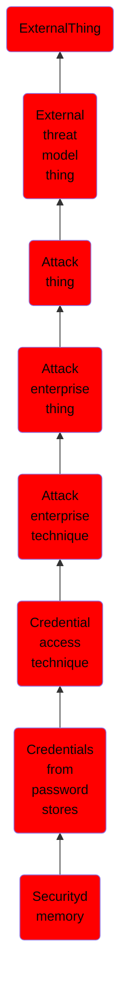

# Securityd memory

## Overview

### Definition
An adversary with root access may gather credentials by reading `securityd`’s memory. `securityd` is a service/daemon responsible for implementing security protocols such as encryption and authorization.(Citation: Apple Dev SecurityD) A privileged adversary may be able to scan through `securityd`'s memory to find the correct sequence of keys to decrypt the user’s logon keychain. This may provide the adversary with various plaintext passwords, such as those for users, WiFi, mail, browsers, certificates, secure notes, etc.(Citation: OS X Keychain)(Citation: OSX Keydnap malware)

### Examples
Not defined.

### Aliases
Not defined.

### URI
http://d3fend.mitre.org/ontologies/d3fend.owl#T1555.002

### Subclass Of

- [ExternalThing](/docs/ontology/reference/model/ExternalThing/ExternalThing.md)
- [External threat model thing](/docs/ontology/reference/model/ExternalThing/External%20threat%20model%20thing/External%20threat%20model%20thing.md)
- [Attack thing](/docs/ontology/reference/model/ExternalThing/External%20threat%20model%20thing/Attack%20thing/Attack%20thing.md)
- [Attack enterprise thing](/docs/ontology/reference/model/ExternalThing/External%20threat%20model%20thing/Attack%20thing/Attack%20enterprise%20thing/Attack%20enterprise%20thing.md)
- [Attack enterprise technique](/docs/ontology/reference/model/ExternalThing/External%20threat%20model%20thing/Attack%20thing/Attack%20enterprise%20thing/Attack%20enterprise%20technique/Attack%20enterprise%20technique.md)
- [Credential access technique](/docs/ontology/reference/model/ExternalThing/External%20threat%20model%20thing/Attack%20thing/Attack%20enterprise%20thing/Attack%20enterprise%20technique/Credential%20access%20technique/Credential%20access%20technique.md)
- [Credentials from password stores](/docs/ontology/reference/model/ExternalThing/External%20threat%20model%20thing/Attack%20thing/Attack%20enterprise%20thing/Attack%20enterprise%20technique/Credential%20access%20technique/Credentials%20from%20password%20stores/Credentials%20from%20password%20stores.md)
- [Securityd memory](/docs/ontology/reference/model/ExternalThing/External%20threat%20model%20thing/Attack%20thing/Attack%20enterprise%20thing/Attack%20enterprise%20technique/Credential%20access%20technique/Credentials%20from%20password%20stores/Securityd%20memory/Securityd%20memory.md)

### Ontology Reference
- [d3fend](http://d3fend.mitre.org/ontologies/d3fend.owl#)

## Properties
