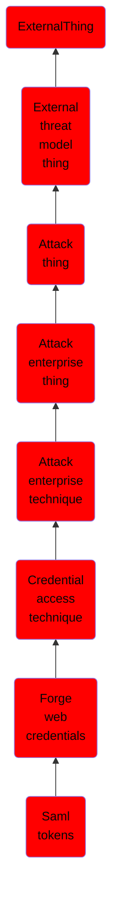

# Saml tokens

## Overview

### Definition
An adversary may forge SAML tokens with any permissions claims and lifetimes if they possess a valid SAML token-signing certificate.(Citation: Microsoft SolarWinds Steps) The default lifetime of a SAML token is one hour, but the validity period can be specified in the <code>NotOnOrAfter</code> value of the <code>conditions ...</code> element in a token. This value can be changed using the <code>AccessTokenLifetime</code> in a <code>LifetimeTokenPolicy</code>.(Citation: Microsoft SAML Token Lifetimes) Forged SAML tokens enable adversaries to authenticate across services that use SAML 2.0 as an SSO (single sign-on) mechanism.(Citation: Cyberark Golden SAML)

### Examples
Not defined.

### Aliases
Not defined.

### URI
http://d3fend.mitre.org/ontologies/d3fend.owl#T1606.002

### Subclass Of

- [ExternalThing](/docs/ontology/reference/model/ExternalThing/ExternalThing.md)
- [External threat model thing](/docs/ontology/reference/model/ExternalThing/External%20threat%20model%20thing/External%20threat%20model%20thing.md)
- [Attack thing](/docs/ontology/reference/model/ExternalThing/External%20threat%20model%20thing/Attack%20thing/Attack%20thing.md)
- [Attack enterprise thing](/docs/ontology/reference/model/ExternalThing/External%20threat%20model%20thing/Attack%20thing/Attack%20enterprise%20thing/Attack%20enterprise%20thing.md)
- [Attack enterprise technique](/docs/ontology/reference/model/ExternalThing/External%20threat%20model%20thing/Attack%20thing/Attack%20enterprise%20thing/Attack%20enterprise%20technique/Attack%20enterprise%20technique.md)
- [Credential access technique](/docs/ontology/reference/model/ExternalThing/External%20threat%20model%20thing/Attack%20thing/Attack%20enterprise%20thing/Attack%20enterprise%20technique/Credential%20access%20technique/Credential%20access%20technique.md)
- [Forge web credentials](/docs/ontology/reference/model/ExternalThing/External%20threat%20model%20thing/Attack%20thing/Attack%20enterprise%20thing/Attack%20enterprise%20technique/Credential%20access%20technique/Forge%20web%20credentials/Forge%20web%20credentials.md)
- [Saml tokens](/docs/ontology/reference/model/ExternalThing/External%20threat%20model%20thing/Attack%20thing/Attack%20enterprise%20thing/Attack%20enterprise%20technique/Credential%20access%20technique/Forge%20web%20credentials/Saml%20tokens/Saml%20tokens.md)

### Ontology Reference
- [d3fend](http://d3fend.mitre.org/ontologies/d3fend.owl#)

## Properties
