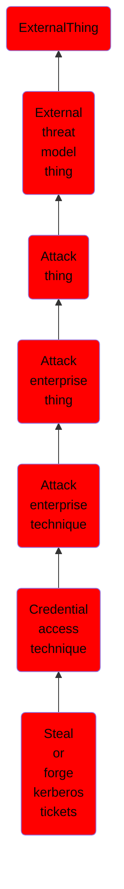

# Steal or forge kerberos tickets

## Overview

### Definition
Adversaries may attempt to subvert Kerberos authentication by stealing or forging Kerberos tickets to enable [Pass the Ticket](https://attack.mitre.org/techniques/T1550/003). Kerberos is an authentication protocol widely used in modern Windows domain environments. In Kerberos environments, referred to as “realms”, there are three basic participants: client, service, and Key Distribution Center (KDC).(Citation: ADSecurity Kerberos Ring Decoder) Clients request access to a service and through the exchange of Kerberos tickets, originating from KDC, they are granted access after having successfully authenticated. The KDC is responsible for both authentication and ticket granting.  Adversaries may attempt to abuse Kerberos by stealing tickets or forging tickets to enable unauthorized access.

### Examples
Not defined.

### Aliases
Not defined.

### URI
http://d3fend.mitre.org/ontologies/d3fend.owl#T1558

### Subclass Of

- [ExternalThing](/docs/ontology/reference/model/ExternalThing/ExternalThing.md)
- [External threat model thing](/docs/ontology/reference/model/ExternalThing/External%20threat%20model%20thing/External%20threat%20model%20thing.md)
- [Attack thing](/docs/ontology/reference/model/ExternalThing/External%20threat%20model%20thing/Attack%20thing/Attack%20thing.md)
- [Attack enterprise thing](/docs/ontology/reference/model/ExternalThing/External%20threat%20model%20thing/Attack%20thing/Attack%20enterprise%20thing/Attack%20enterprise%20thing.md)
- [Attack enterprise technique](/docs/ontology/reference/model/ExternalThing/External%20threat%20model%20thing/Attack%20thing/Attack%20enterprise%20thing/Attack%20enterprise%20technique/Attack%20enterprise%20technique.md)
- [Credential access technique](/docs/ontology/reference/model/ExternalThing/External%20threat%20model%20thing/Attack%20thing/Attack%20enterprise%20thing/Attack%20enterprise%20technique/Credential%20access%20technique/Credential%20access%20technique.md)
- [Steal or forge kerberos tickets](/docs/ontology/reference/model/ExternalThing/External%20threat%20model%20thing/Attack%20thing/Attack%20enterprise%20thing/Attack%20enterprise%20technique/Credential%20access%20technique/Steal%20or%20forge%20kerberos%20tickets/Steal%20or%20forge%20kerberos%20tickets.md)

### Ontology Reference
- [d3fend](http://d3fend.mitre.org/ontologies/d3fend.owl#)

## Properties
