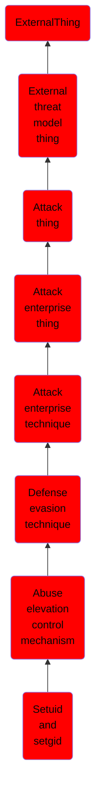

# Setuid and setgid

## Overview

### Definition
An adversary may abuse configurations where an application has the setuid or setgid bits set in order to get code running in a different (and possibly more privileged) user’s context. On Linux or macOS, when the setuid or setgid bits are set for an application binary, the application will run with the privileges of the owning user or group respectively.(Citation: setuid man page) Normally an application is run in the current user’s context, regardless of which user or group owns the application. However, there are instances where programs need to be executed in an elevated context to function properly, but the user running them may not have the specific required privileges.

### Examples
Not defined.

### Aliases
Not defined.

### URI
http://d3fend.mitre.org/ontologies/d3fend.owl#T1548.001

### Subclass Of

- [ExternalThing](/docs/ontology/reference/model/ExternalThing/ExternalThing.md)
- [External threat model thing](/docs/ontology/reference/model/ExternalThing/External%20threat%20model%20thing/External%20threat%20model%20thing.md)
- [Attack thing](/docs/ontology/reference/model/ExternalThing/External%20threat%20model%20thing/Attack%20thing/Attack%20thing.md)
- [Attack enterprise thing](/docs/ontology/reference/model/ExternalThing/External%20threat%20model%20thing/Attack%20thing/Attack%20enterprise%20thing/Attack%20enterprise%20thing.md)
- [Attack enterprise technique](/docs/ontology/reference/model/ExternalThing/External%20threat%20model%20thing/Attack%20thing/Attack%20enterprise%20thing/Attack%20enterprise%20technique/Attack%20enterprise%20technique.md)
- [Defense evasion technique](/docs/ontology/reference/model/ExternalThing/External%20threat%20model%20thing/Attack%20thing/Attack%20enterprise%20thing/Attack%20enterprise%20technique/Defense%20evasion%20technique/Defense%20evasion%20technique.md)
- [Abuse elevation control mechanism](/docs/ontology/reference/model/ExternalThing/External%20threat%20model%20thing/Attack%20thing/Attack%20enterprise%20thing/Attack%20enterprise%20technique/Defense%20evasion%20technique/Abuse%20elevation%20control%20mechanism/Abuse%20elevation%20control%20mechanism.md)
- [Setuid and setgid](/docs/ontology/reference/model/ExternalThing/External%20threat%20model%20thing/Attack%20thing/Attack%20enterprise%20thing/Attack%20enterprise%20technique/Defense%20evasion%20technique/Abuse%20elevation%20control%20mechanism/Setuid%20and%20setgid/Setuid%20and%20setgid.md)

### Ontology Reference
- [d3fend](http://d3fend.mitre.org/ontologies/d3fend.owl#)

## Properties
