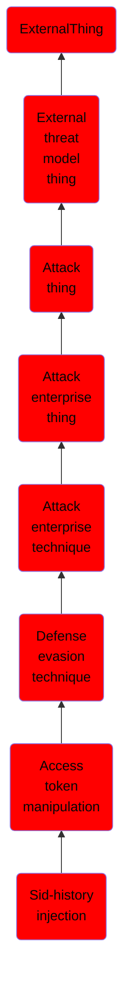

# Sid-history injection

## Overview

### Definition
Adversaries may use SID-History Injection to escalate privileges and bypass access controls. The Windows security identifier (SID) is a unique value that identifies a user or group account. SIDs are used by Windows security in both security descriptors and access tokens. (Citation: Microsoft SID) An account can hold additional SIDs in the SID-History Active Directory attribute (Citation: Microsoft SID-History Attribute), allowing inter-operable account migration between domains (e.g., all values in SID-History are included in access tokens).

### Examples
Not defined.

### Aliases
Not defined.

### URI
http://d3fend.mitre.org/ontologies/d3fend.owl#T1134.005

### Subclass Of

- [ExternalThing](/docs/ontology/reference/model/ExternalThing/ExternalThing.md)
- [External threat model thing](/docs/ontology/reference/model/ExternalThing/External%20threat%20model%20thing/External%20threat%20model%20thing.md)
- [Attack thing](/docs/ontology/reference/model/ExternalThing/External%20threat%20model%20thing/Attack%20thing/Attack%20thing.md)
- [Attack enterprise thing](/docs/ontology/reference/model/ExternalThing/External%20threat%20model%20thing/Attack%20thing/Attack%20enterprise%20thing/Attack%20enterprise%20thing.md)
- [Attack enterprise technique](/docs/ontology/reference/model/ExternalThing/External%20threat%20model%20thing/Attack%20thing/Attack%20enterprise%20thing/Attack%20enterprise%20technique/Attack%20enterprise%20technique.md)
- [Defense evasion technique](/docs/ontology/reference/model/ExternalThing/External%20threat%20model%20thing/Attack%20thing/Attack%20enterprise%20thing/Attack%20enterprise%20technique/Defense%20evasion%20technique/Defense%20evasion%20technique.md)
- [Access token manipulation](/docs/ontology/reference/model/ExternalThing/External%20threat%20model%20thing/Attack%20thing/Attack%20enterprise%20thing/Attack%20enterprise%20technique/Defense%20evasion%20technique/Access%20token%20manipulation/Access%20token%20manipulation.md)
- [Sid-history injection](/docs/ontology/reference/model/ExternalThing/External%20threat%20model%20thing/Attack%20thing/Attack%20enterprise%20thing/Attack%20enterprise%20technique/Defense%20evasion%20technique/Access%20token%20manipulation/Sid-history%20injection/Sid-history%20injection.md)

### Ontology Reference
- [d3fend](http://d3fend.mitre.org/ontologies/d3fend.owl#)

## Properties
