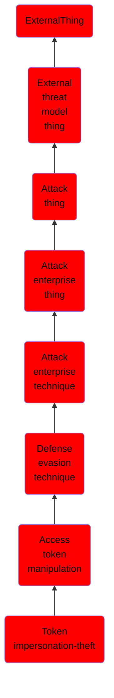

# Token impersonation/theft

## Overview

### Definition
Adversaries may duplicate then impersonate another user's existing token to escalate privileges and bypass access controls. For example, an adversary can duplicate an existing token using `DuplicateToken` or `DuplicateTokenEx`.(Citation: DuplicateToken function) The token can then be used with `ImpersonateLoggedOnUser` to allow the calling thread to impersonate a logged on user's security context, or with `SetThreadToken` to assign the impersonated token to a thread.

### Examples
Not defined.

### Aliases
Not defined.

### URI
http://d3fend.mitre.org/ontologies/d3fend.owl#T1134.001

### Subclass Of

- [ExternalThing](/docs/ontology/reference/model/ExternalThing/ExternalThing.md)
- [External threat model thing](/docs/ontology/reference/model/ExternalThing/External%20threat%20model%20thing/External%20threat%20model%20thing.md)
- [Attack thing](/docs/ontology/reference/model/ExternalThing/External%20threat%20model%20thing/Attack%20thing/Attack%20thing.md)
- [Attack enterprise thing](/docs/ontology/reference/model/ExternalThing/External%20threat%20model%20thing/Attack%20thing/Attack%20enterprise%20thing/Attack%20enterprise%20thing.md)
- [Attack enterprise technique](/docs/ontology/reference/model/ExternalThing/External%20threat%20model%20thing/Attack%20thing/Attack%20enterprise%20thing/Attack%20enterprise%20technique/Attack%20enterprise%20technique.md)
- [Defense evasion technique](/docs/ontology/reference/model/ExternalThing/External%20threat%20model%20thing/Attack%20thing/Attack%20enterprise%20thing/Attack%20enterprise%20technique/Defense%20evasion%20technique/Defense%20evasion%20technique.md)
- [Access token manipulation](/docs/ontology/reference/model/ExternalThing/External%20threat%20model%20thing/Attack%20thing/Attack%20enterprise%20thing/Attack%20enterprise%20technique/Defense%20evasion%20technique/Access%20token%20manipulation/Access%20token%20manipulation.md)
- [Token impersonation-theft](/docs/ontology/reference/model/ExternalThing/External%20threat%20model%20thing/Attack%20thing/Attack%20enterprise%20thing/Attack%20enterprise%20technique/Defense%20evasion%20technique/Access%20token%20manipulation/Token%20impersonation-theft/Token%20impersonation-theft.md)

### Ontology Reference
- [d3fend](http://d3fend.mitre.org/ontologies/d3fend.owl#)

## Properties
