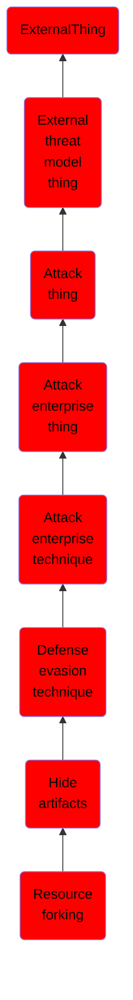

# Resource forking

## Overview

### Definition
Adversaries may abuse resource forks to hide malicious code or executables to evade detection and bypass security applications. A resource fork provides applications a structured way to store resources such as thumbnail images, menu definitions, icons, dialog boxes, and code.(Citation: macOS Hierarchical File System Overview) Usage of a resource fork is identifiable when displaying a file’s extended attributes, using <code>ls -l@</code> or <code>xattr -l</code> commands. Resource forks have been deprecated and replaced with the application bundle structure. Non-localized resources are placed at the top level directory of an application bundle, while localized resources are placed in the <code>/Resources</code> folder.(Citation: Resource and Data Forks)(Citation: ELC Extended Attributes)

### Examples
Not defined.

### Aliases
Not defined.

### URI
http://d3fend.mitre.org/ontologies/d3fend.owl#T1564.009

### Subclass Of

- [ExternalThing](/docs/ontology/reference/model/ExternalThing/ExternalThing.md)
- [External threat model thing](/docs/ontology/reference/model/ExternalThing/External%20threat%20model%20thing/External%20threat%20model%20thing.md)
- [Attack thing](/docs/ontology/reference/model/ExternalThing/External%20threat%20model%20thing/Attack%20thing/Attack%20thing.md)
- [Attack enterprise thing](/docs/ontology/reference/model/ExternalThing/External%20threat%20model%20thing/Attack%20thing/Attack%20enterprise%20thing/Attack%20enterprise%20thing.md)
- [Attack enterprise technique](/docs/ontology/reference/model/ExternalThing/External%20threat%20model%20thing/Attack%20thing/Attack%20enterprise%20thing/Attack%20enterprise%20technique/Attack%20enterprise%20technique.md)
- [Defense evasion technique](/docs/ontology/reference/model/ExternalThing/External%20threat%20model%20thing/Attack%20thing/Attack%20enterprise%20thing/Attack%20enterprise%20technique/Defense%20evasion%20technique/Defense%20evasion%20technique.md)
- [Hide artifacts](/docs/ontology/reference/model/ExternalThing/External%20threat%20model%20thing/Attack%20thing/Attack%20enterprise%20thing/Attack%20enterprise%20technique/Defense%20evasion%20technique/Hide%20artifacts/Hide%20artifacts.md)
- [Resource forking](/docs/ontology/reference/model/ExternalThing/External%20threat%20model%20thing/Attack%20thing/Attack%20enterprise%20thing/Attack%20enterprise%20technique/Defense%20evasion%20technique/Hide%20artifacts/Resource%20forking/Resource%20forking.md)

### Ontology Reference
- [d3fend](http://d3fend.mitre.org/ontologies/d3fend.owl#)

## Properties
