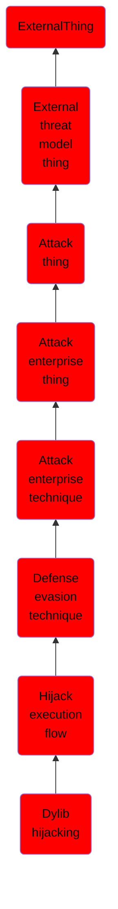

# Dylib hijacking

## Overview

### Definition
Adversaries may execute their own payloads by placing a malicious dynamic library (dylib) with an expected name in a path a victim application searches at runtime. The dynamic loader will try to find the dylibs based on the sequential order of the search paths. Paths to dylibs may be prefixed with <code>@rpath</code>, which allows developers to use relative paths to specify an array of search paths used at runtime based on the location of the executable.  Additionally, if weak linking is used, such as the <code>LC_LOAD_WEAK_DYLIB</code> function, an application will still execute even if an expected dylib is not present. Weak linking enables developers to run an application on multiple macOS versions as new APIs are added.

### Examples
Not defined.

### Aliases
Not defined.

### URI
http://d3fend.mitre.org/ontologies/d3fend.owl#T1574.004

### Subclass Of

- [ExternalThing](/docs/ontology/reference/model/ExternalThing/ExternalThing.md)
- [External threat model thing](/docs/ontology/reference/model/ExternalThing/External%20threat%20model%20thing/External%20threat%20model%20thing.md)
- [Attack thing](/docs/ontology/reference/model/ExternalThing/External%20threat%20model%20thing/Attack%20thing/Attack%20thing.md)
- [Attack enterprise thing](/docs/ontology/reference/model/ExternalThing/External%20threat%20model%20thing/Attack%20thing/Attack%20enterprise%20thing/Attack%20enterprise%20thing.md)
- [Attack enterprise technique](/docs/ontology/reference/model/ExternalThing/External%20threat%20model%20thing/Attack%20thing/Attack%20enterprise%20thing/Attack%20enterprise%20technique/Attack%20enterprise%20technique.md)
- [Defense evasion technique](/docs/ontology/reference/model/ExternalThing/External%20threat%20model%20thing/Attack%20thing/Attack%20enterprise%20thing/Attack%20enterprise%20technique/Defense%20evasion%20technique/Defense%20evasion%20technique.md)
- [Hijack execution flow](/docs/ontology/reference/model/ExternalThing/External%20threat%20model%20thing/Attack%20thing/Attack%20enterprise%20thing/Attack%20enterprise%20technique/Defense%20evasion%20technique/Hijack%20execution%20flow/Hijack%20execution%20flow.md)
- [Dylib hijacking](/docs/ontology/reference/model/ExternalThing/External%20threat%20model%20thing/Attack%20thing/Attack%20enterprise%20thing/Attack%20enterprise%20technique/Defense%20evasion%20technique/Hijack%20execution%20flow/Dylib%20hijacking/Dylib%20hijacking.md)

### Ontology Reference
- [d3fend](http://d3fend.mitre.org/ontologies/d3fend.owl#)

## Properties
