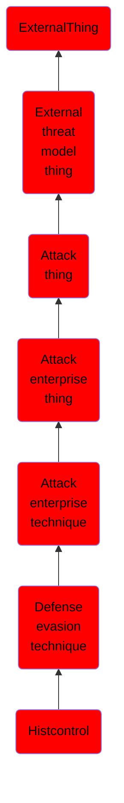

# Histcontrol

## Overview

### Definition
The <code>HISTCONTROL</code> environment variable keeps track of what should be saved by the <code>history</code> command and eventually into the <code>~/.bash_history</code> file when a user logs out. This setting can be configured to ignore commands that start with a space by simply setting it to "ignorespace". <code>HISTCONTROL</code> can also be set to ignore duplicate commands by setting it to "ignoredups". In some Linux systems, this is set by default to "ignoreboth" which covers both of the previous examples. This means that “ ls” will not be saved, but “ls” would be saved by history. <code>HISTCONTROL</code> does not exist by default on macOS, but can be set by the user and will be respected. Adversaries can use this to operate without leaving traces by simply prepending a space to all of their terminal commands.

### Examples
Not defined.

### Aliases
Not defined.

### URI
http://d3fend.mitre.org/ontologies/d3fend.owl#T1148

### Subclass Of

- [ExternalThing](/docs/ontology/reference/model/ExternalThing/ExternalThing.md)
- [External threat model thing](/docs/ontology/reference/model/ExternalThing/External%20threat%20model%20thing/External%20threat%20model%20thing.md)
- [Attack thing](/docs/ontology/reference/model/ExternalThing/External%20threat%20model%20thing/Attack%20thing/Attack%20thing.md)
- [Attack enterprise thing](/docs/ontology/reference/model/ExternalThing/External%20threat%20model%20thing/Attack%20thing/Attack%20enterprise%20thing/Attack%20enterprise%20thing.md)
- [Attack enterprise technique](/docs/ontology/reference/model/ExternalThing/External%20threat%20model%20thing/Attack%20thing/Attack%20enterprise%20thing/Attack%20enterprise%20technique/Attack%20enterprise%20technique.md)
- [Defense evasion technique](/docs/ontology/reference/model/ExternalThing/External%20threat%20model%20thing/Attack%20thing/Attack%20enterprise%20thing/Attack%20enterprise%20technique/Defense%20evasion%20technique/Defense%20evasion%20technique.md)
- [Histcontrol](/docs/ontology/reference/model/ExternalThing/External%20threat%20model%20thing/Attack%20thing/Attack%20enterprise%20thing/Attack%20enterprise%20technique/Defense%20evasion%20technique/Histcontrol/Histcontrol.md)

### Ontology Reference
- [d3fend](http://d3fend.mitre.org/ontologies/d3fend.owl#)

## Properties
