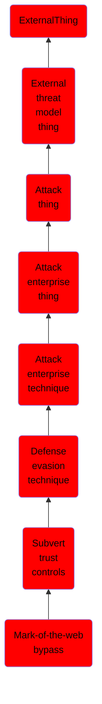

# Mark-of-the-web bypass

## Overview

### Definition
Adversaries may abuse specific file formats to subvert Mark-of-the-Web (MOTW) controls. In Windows, when files are downloaded from the Internet, they are tagged with a hidden NTFS Alternate Data Stream (ADS) named <code>Zone.Identifier</code> with a specific value known as the MOTW.(Citation: Microsoft Zone.Identifier 2020) Files that are tagged with MOTW are protected and cannot perform certain actions. For example, starting in MS Office 10, if a MS Office file has the MOTW, it will open in Protected View. Executables tagged with the MOTW will be processed by Windows Defender SmartScreen that compares files with an allowlist of well-known executables. If the file is not known/trusted, SmartScreen will prevent the execution and warn the user not to run it.(Citation: Beek Use of VHD Dec 2020)(Citation: Outflank MotW 2020)(Citation: Intezer Russian APT Dec 2020)

### Examples
Not defined.

### Aliases
Not defined.

### URI
http://d3fend.mitre.org/ontologies/d3fend.owl#T1553.005

### Subclass Of

- [ExternalThing](/docs/ontology/reference/model/ExternalThing/ExternalThing.md)
- [External threat model thing](/docs/ontology/reference/model/ExternalThing/External%20threat%20model%20thing/External%20threat%20model%20thing.md)
- [Attack thing](/docs/ontology/reference/model/ExternalThing/External%20threat%20model%20thing/Attack%20thing/Attack%20thing.md)
- [Attack enterprise thing](/docs/ontology/reference/model/ExternalThing/External%20threat%20model%20thing/Attack%20thing/Attack%20enterprise%20thing/Attack%20enterprise%20thing.md)
- [Attack enterprise technique](/docs/ontology/reference/model/ExternalThing/External%20threat%20model%20thing/Attack%20thing/Attack%20enterprise%20thing/Attack%20enterprise%20technique/Attack%20enterprise%20technique.md)
- [Defense evasion technique](/docs/ontology/reference/model/ExternalThing/External%20threat%20model%20thing/Attack%20thing/Attack%20enterprise%20thing/Attack%20enterprise%20technique/Defense%20evasion%20technique/Defense%20evasion%20technique.md)
- [Subvert trust controls](/docs/ontology/reference/model/ExternalThing/External%20threat%20model%20thing/Attack%20thing/Attack%20enterprise%20thing/Attack%20enterprise%20technique/Defense%20evasion%20technique/Subvert%20trust%20controls/Subvert%20trust%20controls.md)
- [Mark-of-the-web bypass](/docs/ontology/reference/model/ExternalThing/External%20threat%20model%20thing/Attack%20thing/Attack%20enterprise%20thing/Attack%20enterprise%20technique/Defense%20evasion%20technique/Subvert%20trust%20controls/Mark-of-the-web%20bypass/Mark-of-the-web%20bypass.md)

### Ontology Reference
- [d3fend](http://d3fend.mitre.org/ontologies/d3fend.owl#)

## Properties
