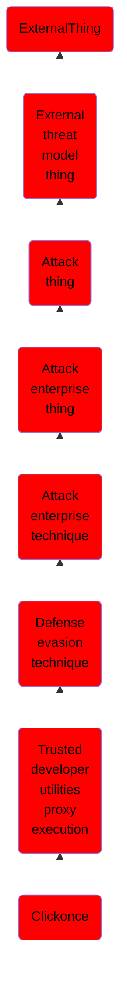

# Clickonce

## Overview

### Definition
Adversaries may use ClickOnce applications (.appref-ms and .application files) to proxy execution of code through a trusted Windows utility.(Citation: Burke/CISA ClickOnce BlackHat) ClickOnce is a deployment that enables a user to create self-updating Windows-based .NET applications (i.e, .XBAP, .EXE, or .DLL) that install and run from a file share or web page with minimal user interaction. The application launches as a child process of DFSVC.EXE, which is responsible for installing, launching, and updating the application.(Citation: SpectorOps Medium ClickOnce)

### Examples
Not defined.

### Aliases
Not defined.

### URI
http://d3fend.mitre.org/ontologies/d3fend.owl#T1127.002

### Subclass Of

- [ExternalThing](/docs/ontology/reference/model/ExternalThing/ExternalThing.md)
- [External threat model thing](/docs/ontology/reference/model/ExternalThing/External%20threat%20model%20thing/External%20threat%20model%20thing.md)
- [Attack thing](/docs/ontology/reference/model/ExternalThing/External%20threat%20model%20thing/Attack%20thing/Attack%20thing.md)
- [Attack enterprise thing](/docs/ontology/reference/model/ExternalThing/External%20threat%20model%20thing/Attack%20thing/Attack%20enterprise%20thing/Attack%20enterprise%20thing.md)
- [Attack enterprise technique](/docs/ontology/reference/model/ExternalThing/External%20threat%20model%20thing/Attack%20thing/Attack%20enterprise%20thing/Attack%20enterprise%20technique/Attack%20enterprise%20technique.md)
- [Defense evasion technique](/docs/ontology/reference/model/ExternalThing/External%20threat%20model%20thing/Attack%20thing/Attack%20enterprise%20thing/Attack%20enterprise%20technique/Defense%20evasion%20technique/Defense%20evasion%20technique.md)
- [Trusted developer utilities proxy execution](/docs/ontology/reference/model/ExternalThing/External%20threat%20model%20thing/Attack%20thing/Attack%20enterprise%20thing/Attack%20enterprise%20technique/Defense%20evasion%20technique/Trusted%20developer%20utilities%20proxy%20execution/Trusted%20developer%20utilities%20proxy%20execution.md)
- [Clickonce](/docs/ontology/reference/model/ExternalThing/External%20threat%20model%20thing/Attack%20thing/Attack%20enterprise%20thing/Attack%20enterprise%20technique/Defense%20evasion%20technique/Trusted%20developer%20utilities%20proxy%20execution/Clickonce/Clickonce.md)

### Ontology Reference
- [d3fend](http://d3fend.mitre.org/ontologies/d3fend.owl#)

## Properties
