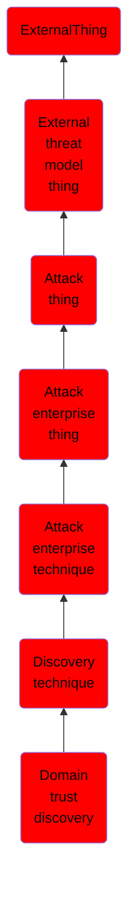

# Domain trust discovery

## Overview

### Definition
Adversaries may attempt to gather information on domain trust relationships that may be used to identify lateral movement opportunities in Windows multi-domain/forest environments. Domain trusts provide a mechanism for a domain to allow access to resources based on the authentication procedures of another domain.(Citation: Microsoft Trusts) Domain trusts allow the users of the trusted domain to access resources in the trusting domain. The information discovered may help the adversary conduct [SID-History Injection](https://attack.mitre.org/techniques/T1134/005), [Pass the Ticket](https://attack.mitre.org/techniques/T1550/003), and [Kerberoasting](https://attack.mitre.org/techniques/T1558/003).(Citation: AdSecurity Forging Trust Tickets)(Citation: Harmj0y Domain Trusts) Domain trusts can be enumerated using the `DSEnumerateDomainTrusts()` Win32 API call, .NET methods, and LDAP.(Citation: Harmj0y Domain Trusts) The Windows utility [Nltest](https://attack.mitre.org/software/S0359) is known to be used by adversaries to enumerate domain trusts.(Citation: Microsoft Operation Wilysupply)

### Examples
Not defined.

### Aliases
Not defined.

### URI
http://d3fend.mitre.org/ontologies/d3fend.owl#T1482

### Subclass Of

- [ExternalThing](/docs/ontology/reference/model/ExternalThing/ExternalThing.md)
- [External threat model thing](/docs/ontology/reference/model/ExternalThing/External%20threat%20model%20thing/External%20threat%20model%20thing.md)
- [Attack thing](/docs/ontology/reference/model/ExternalThing/External%20threat%20model%20thing/Attack%20thing/Attack%20thing.md)
- [Attack enterprise thing](/docs/ontology/reference/model/ExternalThing/External%20threat%20model%20thing/Attack%20thing/Attack%20enterprise%20thing/Attack%20enterprise%20thing.md)
- [Attack enterprise technique](/docs/ontology/reference/model/ExternalThing/External%20threat%20model%20thing/Attack%20thing/Attack%20enterprise%20thing/Attack%20enterprise%20technique/Attack%20enterprise%20technique.md)
- [Discovery technique](/docs/ontology/reference/model/ExternalThing/External%20threat%20model%20thing/Attack%20thing/Attack%20enterprise%20thing/Attack%20enterprise%20technique/Discovery%20technique/Discovery%20technique.md)
- [Domain trust discovery](/docs/ontology/reference/model/ExternalThing/External%20threat%20model%20thing/Attack%20thing/Attack%20enterprise%20thing/Attack%20enterprise%20technique/Discovery%20technique/Domain%20trust%20discovery/Domain%20trust%20discovery.md)

### Ontology Reference
- [d3fend](http://d3fend.mitre.org/ontologies/d3fend.owl#)

## Properties
