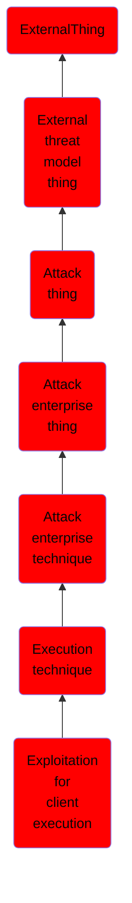

# Exploitation for client execution

## Overview

### Definition
Adversaries may exploit software vulnerabilities in client applications to execute code. Vulnerabilities can exist in software due to unsecure coding practices that can lead to unanticipated behavior. Adversaries can take advantage of certain vulnerabilities through targeted exploitation for the purpose of arbitrary code execution. Oftentimes the most valuable exploits to an offensive toolkit are those that can be used to obtain code execution on a remote system because they can be used to gain access to that system. Users will expect to see files related to the applications they commonly used to do work, so they are a useful target for exploit research and development because of their high utility.

### Examples
Not defined.

### Aliases
Not defined.

### URI
http://d3fend.mitre.org/ontologies/d3fend.owl#T1203

### Subclass Of

- [ExternalThing](/docs/ontology/reference/model/ExternalThing/ExternalThing.md)
- [External threat model thing](/docs/ontology/reference/model/ExternalThing/External%20threat%20model%20thing/External%20threat%20model%20thing.md)
- [Attack thing](/docs/ontology/reference/model/ExternalThing/External%20threat%20model%20thing/Attack%20thing/Attack%20thing.md)
- [Attack enterprise thing](/docs/ontology/reference/model/ExternalThing/External%20threat%20model%20thing/Attack%20thing/Attack%20enterprise%20thing/Attack%20enterprise%20thing.md)
- [Attack enterprise technique](/docs/ontology/reference/model/ExternalThing/External%20threat%20model%20thing/Attack%20thing/Attack%20enterprise%20thing/Attack%20enterprise%20technique/Attack%20enterprise%20technique.md)
- [Execution technique](/docs/ontology/reference/model/ExternalThing/External%20threat%20model%20thing/Attack%20thing/Attack%20enterprise%20thing/Attack%20enterprise%20technique/Execution%20technique/Execution%20technique.md)
- [Exploitation for client execution](/docs/ontology/reference/model/ExternalThing/External%20threat%20model%20thing/Attack%20thing/Attack%20enterprise%20thing/Attack%20enterprise%20technique/Execution%20technique/Exploitation%20for%20client%20execution/Exploitation%20for%20client%20execution.md)

### Ontology Reference
- [d3fend](http://d3fend.mitre.org/ontologies/d3fend.owl#)

## Properties
