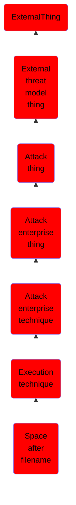

# Space after filename

## Overview

### Definition
Adversaries can hide a program's true filetype by changing the extension of a file. With certain file types (specifically this does not work with .app extensions), appending a space to the end of a filename will change how the file is processed by the operating system. For example, if there is a Mach-O executable file called evil.bin, when it is double clicked by a user, it will launch Terminal.app and execute. If this file is renamed to evil.txt, then when double clicked by a user, it will launch with the default text editing application (not executing the binary). However, if the file is renamed to "evil.txt " (note the space at the end), then when double clicked by a user, the true file type is determined by the OS and handled appropriately and the binary will be executed (Citation: Mac Backdoors are back).

### Examples
Not defined.

### Aliases
Not defined.

### URI
http://d3fend.mitre.org/ontologies/d3fend.owl#T1151

### Subclass Of

- [ExternalThing](/docs/ontology/reference/model/ExternalThing/ExternalThing.md)
- [External threat model thing](/docs/ontology/reference/model/ExternalThing/External%20threat%20model%20thing/External%20threat%20model%20thing.md)
- [Attack thing](/docs/ontology/reference/model/ExternalThing/External%20threat%20model%20thing/Attack%20thing/Attack%20thing.md)
- [Attack enterprise thing](/docs/ontology/reference/model/ExternalThing/External%20threat%20model%20thing/Attack%20thing/Attack%20enterprise%20thing/Attack%20enterprise%20thing.md)
- [Attack enterprise technique](/docs/ontology/reference/model/ExternalThing/External%20threat%20model%20thing/Attack%20thing/Attack%20enterprise%20thing/Attack%20enterprise%20technique/Attack%20enterprise%20technique.md)
- [Execution technique](/docs/ontology/reference/model/ExternalThing/External%20threat%20model%20thing/Attack%20thing/Attack%20enterprise%20thing/Attack%20enterprise%20technique/Execution%20technique/Execution%20technique.md)
- [Space after filename](/docs/ontology/reference/model/ExternalThing/External%20threat%20model%20thing/Attack%20thing/Attack%20enterprise%20thing/Attack%20enterprise%20technique/Execution%20technique/Space%20after%20filename/Space%20after%20filename.md)

### Ontology Reference
- [d3fend](http://d3fend.mitre.org/ontologies/d3fend.owl#)

## Properties
