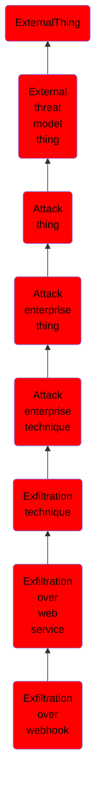

# Exfiltration over webhook

## Overview

### Definition
Adversaries may exfiltrate data to a webhook endpoint rather than over their primary command and control channel. Webhooks are simple mechanisms for allowing a server to push data over HTTP/S to a client without the need for the client to continuously poll the server.(Citation: RedHat Webhooks) Many public and commercial services, such as Discord, Slack, and `webhook.site`, support the creation of webhook endpoints that can be used by other services, such as Github, Jira, or Trello.(Citation: Discord Intro to Webhooks) When changes happen in the linked services (such as pushing a repository update or modifying a ticket), these services will automatically post the data to the webhook endpoint for use by the consuming application.

### Examples
Not defined.

### Aliases
Not defined.

### URI
http://d3fend.mitre.org/ontologies/d3fend.owl#T1567.004

### Subclass Of

- [ExternalThing](/docs/ontology/reference/model/ExternalThing/ExternalThing.md)
- [External threat model thing](/docs/ontology/reference/model/ExternalThing/External%20threat%20model%20thing/External%20threat%20model%20thing.md)
- [Attack thing](/docs/ontology/reference/model/ExternalThing/External%20threat%20model%20thing/Attack%20thing/Attack%20thing.md)
- [Attack enterprise thing](/docs/ontology/reference/model/ExternalThing/External%20threat%20model%20thing/Attack%20thing/Attack%20enterprise%20thing/Attack%20enterprise%20thing.md)
- [Attack enterprise technique](/docs/ontology/reference/model/ExternalThing/External%20threat%20model%20thing/Attack%20thing/Attack%20enterprise%20thing/Attack%20enterprise%20technique/Attack%20enterprise%20technique.md)
- [Exfiltration technique](/docs/ontology/reference/model/ExternalThing/External%20threat%20model%20thing/Attack%20thing/Attack%20enterprise%20thing/Attack%20enterprise%20technique/Exfiltration%20technique/Exfiltration%20technique.md)
- [Exfiltration over web service](/docs/ontology/reference/model/ExternalThing/External%20threat%20model%20thing/Attack%20thing/Attack%20enterprise%20thing/Attack%20enterprise%20technique/Exfiltration%20technique/Exfiltration%20over%20web%20service/Exfiltration%20over%20web%20service.md)
- [Exfiltration over webhook](/docs/ontology/reference/model/ExternalThing/External%20threat%20model%20thing/Attack%20thing/Attack%20enterprise%20thing/Attack%20enterprise%20technique/Exfiltration%20technique/Exfiltration%20over%20web%20service/Exfiltration%20over%20webhook/Exfiltration%20over%20webhook.md)

### Ontology Reference
- [d3fend](http://d3fend.mitre.org/ontologies/d3fend.owl#)

## Properties
