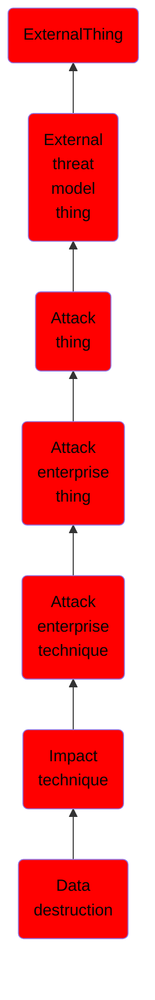

# Data destruction

## Overview

### Definition
Adversaries may destroy data and files on specific systems or in large numbers on a network to interrupt availability to systems, services, and network resources. Data destruction is likely to render stored data irrecoverable by forensic techniques through overwriting files or data on local and remote drives.(Citation: Symantec Shamoon 2012)(Citation: FireEye Shamoon Nov 2016)(Citation: Palo Alto Shamoon Nov 2016)(Citation: Kaspersky StoneDrill 2017)(Citation: Unit 42 Shamoon3 2018)(Citation: Talos Olympic Destroyer 2018) Common operating system file deletion commands such as <code>del</code> and <code>rm</code> often only remove pointers to files without wiping the contents of the files themselves, making the files recoverable by proper forensic methodology. This behavior is distinct from [Disk Content Wipe](https://attack.mitre.org/techniques/T1561/001) and [Disk Structure Wipe](https://attack.mitre.org/techniques/T1561/002) because individual files are destroyed rather than sections of a storage disk or the disk's logical structure.

### Examples
Not defined.

### Aliases
Not defined.

### URI
http://d3fend.mitre.org/ontologies/d3fend.owl#T1485

### Subclass Of

- [ExternalThing](/docs/ontology/reference/model/ExternalThing/ExternalThing.md)
- [External threat model thing](/docs/ontology/reference/model/ExternalThing/External%20threat%20model%20thing/External%20threat%20model%20thing.md)
- [Attack thing](/docs/ontology/reference/model/ExternalThing/External%20threat%20model%20thing/Attack%20thing/Attack%20thing.md)
- [Attack enterprise thing](/docs/ontology/reference/model/ExternalThing/External%20threat%20model%20thing/Attack%20thing/Attack%20enterprise%20thing/Attack%20enterprise%20thing.md)
- [Attack enterprise technique](/docs/ontology/reference/model/ExternalThing/External%20threat%20model%20thing/Attack%20thing/Attack%20enterprise%20thing/Attack%20enterprise%20technique/Attack%20enterprise%20technique.md)
- [Impact technique](/docs/ontology/reference/model/ExternalThing/External%20threat%20model%20thing/Attack%20thing/Attack%20enterprise%20thing/Attack%20enterprise%20technique/Impact%20technique/Impact%20technique.md)
- [Data destruction](/docs/ontology/reference/model/ExternalThing/External%20threat%20model%20thing/Attack%20thing/Attack%20enterprise%20thing/Attack%20enterprise%20technique/Impact%20technique/Data%20destruction/Data%20destruction.md)

### Ontology Reference
- [d3fend](http://d3fend.mitre.org/ontologies/d3fend.owl#)

## Properties
