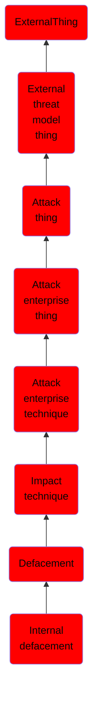

# Internal defacement

## Overview

### Definition
An adversary may deface systems internal to an organization in an attempt to intimidate or mislead users, thus discrediting the integrity of the systems. This may take the form of modifications to internal websites, or directly to user systems with the replacement of the desktop wallpaper.(Citation: Novetta Blockbuster) Disturbing or offensive images may be used as a part of [Internal Defacement](https://attack.mitre.org/techniques/T1491/001) in order to cause user discomfort, or to pressure compliance with accompanying messages. Since internally defacing systems exposes an adversary's presence, it often takes place after other intrusion goals have been accomplished.(Citation: Novetta Blockbuster Destructive Malware)

### Examples
Not defined.

### Aliases
Not defined.

### URI
http://d3fend.mitre.org/ontologies/d3fend.owl#T1491.001

### Subclass Of

- [ExternalThing](/docs/ontology/reference/model/ExternalThing/ExternalThing.md)
- [External threat model thing](/docs/ontology/reference/model/ExternalThing/External%20threat%20model%20thing/External%20threat%20model%20thing.md)
- [Attack thing](/docs/ontology/reference/model/ExternalThing/External%20threat%20model%20thing/Attack%20thing/Attack%20thing.md)
- [Attack enterprise thing](/docs/ontology/reference/model/ExternalThing/External%20threat%20model%20thing/Attack%20thing/Attack%20enterprise%20thing/Attack%20enterprise%20thing.md)
- [Attack enterprise technique](/docs/ontology/reference/model/ExternalThing/External%20threat%20model%20thing/Attack%20thing/Attack%20enterprise%20thing/Attack%20enterprise%20technique/Attack%20enterprise%20technique.md)
- [Impact technique](/docs/ontology/reference/model/ExternalThing/External%20threat%20model%20thing/Attack%20thing/Attack%20enterprise%20thing/Attack%20enterprise%20technique/Impact%20technique/Impact%20technique.md)
- [Defacement](/docs/ontology/reference/model/ExternalThing/External%20threat%20model%20thing/Attack%20thing/Attack%20enterprise%20thing/Attack%20enterprise%20technique/Impact%20technique/Defacement/Defacement.md)
- [Internal defacement](/docs/ontology/reference/model/ExternalThing/External%20threat%20model%20thing/Attack%20thing/Attack%20enterprise%20thing/Attack%20enterprise%20technique/Impact%20technique/Defacement/Internal%20defacement/Internal%20defacement.md)

### Ontology Reference
- [d3fend](http://d3fend.mitre.org/ontologies/d3fend.owl#)

## Properties
