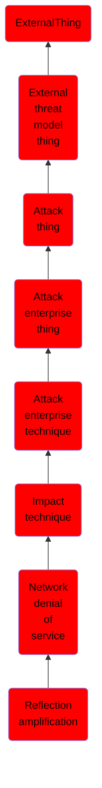

# Reflection amplification

## Overview

### Definition
Adversaries may attempt to cause a denial of service (DoS) by reflecting a high-volume of network traffic to a target. This type of Network DoS takes advantage of a third-party server intermediary that hosts and will respond to a given spoofed source IP address. This third-party server is commonly termed a reflector. An adversary accomplishes a reflection attack by sending packets to reflectors with the spoofed address of the victim. Similar to Direct Network Floods, more than one system may be used to conduct the attack, or a botnet may be used. Likewise, one or more reflectors may be used to focus traffic on the target.(Citation: Cloudflare ReflectionDoS May 2017) This Network DoS attack may also reduce the availability and functionality of the targeted system(s) and network.

### Examples
Not defined.

### Aliases
Not defined.

### URI
http://d3fend.mitre.org/ontologies/d3fend.owl#T1498.002

### Subclass Of

- [ExternalThing](/docs/ontology/reference/model/ExternalThing/ExternalThing.md)
- [External threat model thing](/docs/ontology/reference/model/ExternalThing/External%20threat%20model%20thing/External%20threat%20model%20thing.md)
- [Attack thing](/docs/ontology/reference/model/ExternalThing/External%20threat%20model%20thing/Attack%20thing/Attack%20thing.md)
- [Attack enterprise thing](/docs/ontology/reference/model/ExternalThing/External%20threat%20model%20thing/Attack%20thing/Attack%20enterprise%20thing/Attack%20enterprise%20thing.md)
- [Attack enterprise technique](/docs/ontology/reference/model/ExternalThing/External%20threat%20model%20thing/Attack%20thing/Attack%20enterprise%20thing/Attack%20enterprise%20technique/Attack%20enterprise%20technique.md)
- [Impact technique](/docs/ontology/reference/model/ExternalThing/External%20threat%20model%20thing/Attack%20thing/Attack%20enterprise%20thing/Attack%20enterprise%20technique/Impact%20technique/Impact%20technique.md)
- [Network denial of service](/docs/ontology/reference/model/ExternalThing/External%20threat%20model%20thing/Attack%20thing/Attack%20enterprise%20thing/Attack%20enterprise%20technique/Impact%20technique/Network%20denial%20of%20service/Network%20denial%20of%20service.md)
- [Reflection amplification](/docs/ontology/reference/model/ExternalThing/External%20threat%20model%20thing/Attack%20thing/Attack%20enterprise%20thing/Attack%20enterprise%20technique/Impact%20technique/Network%20denial%20of%20service/Reflection%20amplification/Reflection%20amplification.md)

### Ontology Reference
- [d3fend](http://d3fend.mitre.org/ontologies/d3fend.owl#)

## Properties
