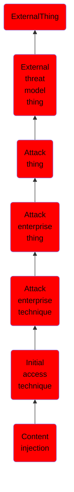

# Content injection

## Overview

### Definition
Adversaries may gain access and continuously communicate with victims by injecting malicious content into systems through online network traffic. Rather than luring victims to malicious payloads hosted on a compromised website (i.e., [Drive-by Target](https://attack.mitre.org/techniques/T1608/004) followed by [Drive-by Compromise](https://attack.mitre.org/techniques/T1189)), adversaries may initially access victims through compromised data-transfer channels where they can manipulate traffic and/or inject their own content. These compromised online network channels may also be used to deliver additional payloads (i.e., [Ingress Tool Transfer](https://attack.mitre.org/techniques/T1105)) and other data to already compromised systems.(Citation: ESET MoustachedBouncer)

### Examples
Not defined.

### Aliases
Not defined.

### URI
http://d3fend.mitre.org/ontologies/d3fend.owl#T1659

### Subclass Of

- [ExternalThing](/docs/ontology/reference/model/ExternalThing/ExternalThing.md)
- [External threat model thing](/docs/ontology/reference/model/ExternalThing/External%20threat%20model%20thing/External%20threat%20model%20thing.md)
- [Attack thing](/docs/ontology/reference/model/ExternalThing/External%20threat%20model%20thing/Attack%20thing/Attack%20thing.md)
- [Attack enterprise thing](/docs/ontology/reference/model/ExternalThing/External%20threat%20model%20thing/Attack%20thing/Attack%20enterprise%20thing/Attack%20enterprise%20thing.md)
- [Attack enterprise technique](/docs/ontology/reference/model/ExternalThing/External%20threat%20model%20thing/Attack%20thing/Attack%20enterprise%20thing/Attack%20enterprise%20technique/Attack%20enterprise%20technique.md)
- [Initial access technique](/docs/ontology/reference/model/ExternalThing/External%20threat%20model%20thing/Attack%20thing/Attack%20enterprise%20thing/Attack%20enterprise%20technique/Initial%20access%20technique/Initial%20access%20technique.md)
- [Content injection](/docs/ontology/reference/model/ExternalThing/External%20threat%20model%20thing/Attack%20thing/Attack%20enterprise%20thing/Attack%20enterprise%20technique/Initial%20access%20technique/Content%20injection/Content%20injection.md)

### Ontology Reference
- [d3fend](http://d3fend.mitre.org/ontologies/d3fend.owl#)

## Properties
