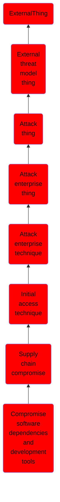

# Compromise software dependencies and development tools

## Overview

### Definition
Adversaries may manipulate software dependencies and development tools prior to receipt by a final consumer for the purpose of data or system compromise. Applications often depend on external software to function properly. Popular open source projects that are used as dependencies in many applications may be targeted as a means to add malicious code to users of the dependency.(Citation: Trendmicro NPM Compromise)

### Examples
Not defined.

### Aliases
Not defined.

### URI
http://d3fend.mitre.org/ontologies/d3fend.owl#T1195.001

### Subclass Of

- [ExternalThing](/docs/ontology/reference/model/ExternalThing/ExternalThing.md)
- [External threat model thing](/docs/ontology/reference/model/ExternalThing/External%20threat%20model%20thing/External%20threat%20model%20thing.md)
- [Attack thing](/docs/ontology/reference/model/ExternalThing/External%20threat%20model%20thing/Attack%20thing/Attack%20thing.md)
- [Attack enterprise thing](/docs/ontology/reference/model/ExternalThing/External%20threat%20model%20thing/Attack%20thing/Attack%20enterprise%20thing/Attack%20enterprise%20thing.md)
- [Attack enterprise technique](/docs/ontology/reference/model/ExternalThing/External%20threat%20model%20thing/Attack%20thing/Attack%20enterprise%20thing/Attack%20enterprise%20technique/Attack%20enterprise%20technique.md)
- [Initial access technique](/docs/ontology/reference/model/ExternalThing/External%20threat%20model%20thing/Attack%20thing/Attack%20enterprise%20thing/Attack%20enterprise%20technique/Initial%20access%20technique/Initial%20access%20technique.md)
- [Supply chain compromise](/docs/ontology/reference/model/ExternalThing/External%20threat%20model%20thing/Attack%20thing/Attack%20enterprise%20thing/Attack%20enterprise%20technique/Initial%20access%20technique/Supply%20chain%20compromise/Supply%20chain%20compromise.md)
- [Compromise software dependencies and development tools](/docs/ontology/reference/model/ExternalThing/External%20threat%20model%20thing/Attack%20thing/Attack%20enterprise%20thing/Attack%20enterprise%20technique/Initial%20access%20technique/Supply%20chain%20compromise/Compromise%20software%20dependencies%20and%20development%20tools/Compromise%20software%20dependencies%20and%20development%20tools.md)

### Ontology Reference
- [d3fend](http://d3fend.mitre.org/ontologies/d3fend.owl#)

## Properties
