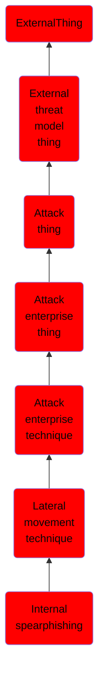

# Internal spearphishing

## Overview

### Definition
After they already have access to accounts or systems within the environment, adversaries may use internal spearphishing to gain access to additional information or compromise other users within the same organization. Internal spearphishing is multi-staged campaign where a legitimate account is initially compromised either by controlling the user's device or by compromising the account credentials of the user. Adversaries may then attempt to take advantage of the trusted internal account to increase the likelihood of tricking more victims into falling for phish attempts, often incorporating [Impersonation](https://attack.mitre.org/techniques/T1656).(Citation: Trend Micro - Int SP)

### Examples
Not defined.

### Aliases
Not defined.

### URI
http://d3fend.mitre.org/ontologies/d3fend.owl#T1534

### Subclass Of

- [ExternalThing](/docs/ontology/reference/model/ExternalThing/ExternalThing.md)
- [External threat model thing](/docs/ontology/reference/model/ExternalThing/External%20threat%20model%20thing/External%20threat%20model%20thing.md)
- [Attack thing](/docs/ontology/reference/model/ExternalThing/External%20threat%20model%20thing/Attack%20thing/Attack%20thing.md)
- [Attack enterprise thing](/docs/ontology/reference/model/ExternalThing/External%20threat%20model%20thing/Attack%20thing/Attack%20enterprise%20thing/Attack%20enterprise%20thing.md)
- [Attack enterprise technique](/docs/ontology/reference/model/ExternalThing/External%20threat%20model%20thing/Attack%20thing/Attack%20enterprise%20thing/Attack%20enterprise%20technique/Attack%20enterprise%20technique.md)
- [Lateral movement technique](/docs/ontology/reference/model/ExternalThing/External%20threat%20model%20thing/Attack%20thing/Attack%20enterprise%20thing/Attack%20enterprise%20technique/Lateral%20movement%20technique/Lateral%20movement%20technique.md)
- [Internal spearphishing](/docs/ontology/reference/model/ExternalThing/External%20threat%20model%20thing/Attack%20thing/Attack%20enterprise%20thing/Attack%20enterprise%20technique/Lateral%20movement%20technique/Internal%20spearphishing/Internal%20spearphishing.md)

### Ontology Reference
- [d3fend](http://d3fend.mitre.org/ontologies/d3fend.owl#)

## Properties
