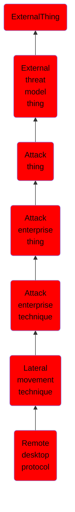

# Remote desktop protocol

## Overview

### Definition
Remote desktop is a common feature in operating systems. It allows a user to log into an interactive session with a system desktop graphical user interface on a remote system. Microsoft refers to its implementation of the Remote Desktop Protocol (RDP) as Remote Desktop Services (RDS). (Citation: TechNet Remote Desktop Services) There are other implementations and third-party tools that provide graphical access [Remote Services](https://attack.mitre.org/techniques/T1021) similar to RDS.

### Examples
Not defined.

### Aliases
Not defined.

### URI
http://d3fend.mitre.org/ontologies/d3fend.owl#T1076

### Subclass Of

- [ExternalThing](/docs/ontology/reference/model/ExternalThing/ExternalThing.md)
- [External threat model thing](/docs/ontology/reference/model/ExternalThing/External%20threat%20model%20thing/External%20threat%20model%20thing.md)
- [Attack thing](/docs/ontology/reference/model/ExternalThing/External%20threat%20model%20thing/Attack%20thing/Attack%20thing.md)
- [Attack enterprise thing](/docs/ontology/reference/model/ExternalThing/External%20threat%20model%20thing/Attack%20thing/Attack%20enterprise%20thing/Attack%20enterprise%20thing.md)
- [Attack enterprise technique](/docs/ontology/reference/model/ExternalThing/External%20threat%20model%20thing/Attack%20thing/Attack%20enterprise%20thing/Attack%20enterprise%20technique/Attack%20enterprise%20technique.md)
- [Lateral movement technique](/docs/ontology/reference/model/ExternalThing/External%20threat%20model%20thing/Attack%20thing/Attack%20enterprise%20thing/Attack%20enterprise%20technique/Lateral%20movement%20technique/Lateral%20movement%20technique.md)
- [Remote desktop protocol](/docs/ontology/reference/model/ExternalThing/External%20threat%20model%20thing/Attack%20thing/Attack%20enterprise%20thing/Attack%20enterprise%20technique/Lateral%20movement%20technique/Remote%20desktop%20protocol/Remote%20desktop%20protocol.md)

### Ontology Reference
- [d3fend](http://d3fend.mitre.org/ontologies/d3fend.owl#)

## Properties
