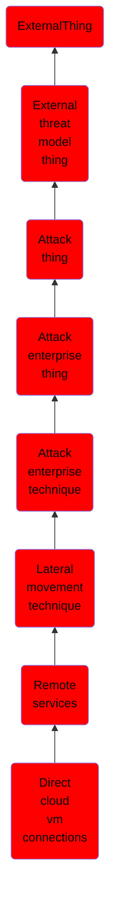

# Direct cloud vm connections

## Overview

### Definition
Adversaries may leverage [Valid Accounts](https://attack.mitre.org/techniques/T1078) to log directly into accessible cloud hosted compute infrastructure through cloud native methods. Many cloud providers offer interactive connections to virtual infrastructure that can be accessed through the [Cloud API](https://attack.mitre.org/techniques/T1059/009), such as Azure Serial Console(Citation: Azure Serial Console), AWS EC2 Instance Connect(Citation: EC2 Instance Connect)(Citation: lucr-3: Getting SaaS-y in the cloud), and AWS System Manager.(Citation: AWS System Manager).

### Examples
Not defined.

### Aliases
Not defined.

### URI
http://d3fend.mitre.org/ontologies/d3fend.owl#T1021.008

### Subclass Of

- [ExternalThing](/docs/ontology/reference/model/ExternalThing/ExternalThing.md)
- [External threat model thing](/docs/ontology/reference/model/ExternalThing/External%20threat%20model%20thing/External%20threat%20model%20thing.md)
- [Attack thing](/docs/ontology/reference/model/ExternalThing/External%20threat%20model%20thing/Attack%20thing/Attack%20thing.md)
- [Attack enterprise thing](/docs/ontology/reference/model/ExternalThing/External%20threat%20model%20thing/Attack%20thing/Attack%20enterprise%20thing/Attack%20enterprise%20thing.md)
- [Attack enterprise technique](/docs/ontology/reference/model/ExternalThing/External%20threat%20model%20thing/Attack%20thing/Attack%20enterprise%20thing/Attack%20enterprise%20technique/Attack%20enterprise%20technique.md)
- [Lateral movement technique](/docs/ontology/reference/model/ExternalThing/External%20threat%20model%20thing/Attack%20thing/Attack%20enterprise%20thing/Attack%20enterprise%20technique/Lateral%20movement%20technique/Lateral%20movement%20technique.md)
- [Remote services](/docs/ontology/reference/model/ExternalThing/External%20threat%20model%20thing/Attack%20thing/Attack%20enterprise%20thing/Attack%20enterprise%20technique/Lateral%20movement%20technique/Remote%20services/Remote%20services.md)
- [Direct cloud vm connections](/docs/ontology/reference/model/ExternalThing/External%20threat%20model%20thing/Attack%20thing/Attack%20enterprise%20thing/Attack%20enterprise%20technique/Lateral%20movement%20technique/Remote%20services/Direct%20cloud%20vm%20connections/Direct%20cloud%20vm%20connections.md)

### Ontology Reference
- [d3fend](http://d3fend.mitre.org/ontologies/d3fend.owl#)

## Properties
